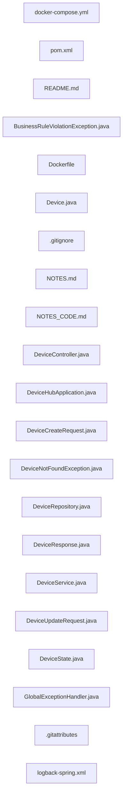
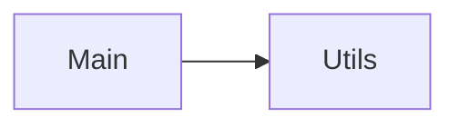

Repository Summary:
Files analyzed: 21
Directories scanned: 231
Total size: 122.15 KB (125086 bytes)
Estimated tokens: 31271
Processing time: 0.06 seconds


## Table of Contents

- [Project Summary](#project-summary)
- [Directory Structure](#directory-structure)
- [Files Content](#files-content)
  - Files By Category:
    - Configuration (3 files):
      - [.gitignore](#_gitignore) - 749 bytes
      - [docker-compose.yml](#docker-compose_yml) - 748 bytes
      - [pom.xml](#pom_xml) - 3.5 KB
    - Documentation (3 files):
      - [NOTES_CODE.md](#NOTES_CODE_md) - 25.1 KB
      - [NOTES.md](#NOTES_md) - 52.6 KB
      - [README.md](#README_md) - 8.6 KB
    - Java (12 files):
      - [BusinessRuleViolationException.java](#BusinessRuleViolationException_java) - 264 bytes
      - [Device.java](#Device_java) - 1013 bytes
      - [DeviceController.java](#DeviceController_java) - 9.2 KB
      - [DeviceCreateRequest.java](#DeviceCreateRequest_java) - 757 bytes
      - [DeviceHubApplication.java](#DeviceHubApplication_java) - 643 bytes
      - [DeviceNotFoundException.java](#DeviceNotFoundException_java) - 263 bytes
      - [DeviceRepository.java](#DeviceRepository_java) - 910 bytes
      - [DeviceResponse.java](#DeviceResponse_java) - 759 bytes
      - [DeviceService.java](#DeviceService_java) - 8.4 KB
      - [DeviceState.java](#DeviceState_java) - 103 bytes
      - [and 2 more Java files...]
    - Other (2 files):
      - [.gitattributes](#_gitattributes) - 558 bytes
      - [Dockerfile](#Dockerfile) - 986 bytes
    - Other (xml) (1 files):
      - [logback-spring.xml](#logback-spring_xml) - 2.0 KB
- [Architecture and Relationships](#architecture-and-relationships)
  - [File Dependencies](#file-dependencies)
  - [Class Relationships](#class-relationships)
  - [Component Interactions](#component-interactions)

## Project Summary <a id="project-summary"></a>

# Project Digest: devicehub-api
Generated on: Sat Jan 24 2026 15:35:29 GMT+0100 (Central European Standard Time)
Source: /Users/herman/Documents/Code/devicehub-api
Project Directory: /Users/herman/Documents/Code/devicehub-api

# Directory Structure
[DIR] .
  [DIR] .git
  [FILE] .gitattributes
  [DIR] .github
  [FILE] .gitignore
  [DIR] CodeFlattened_Output
  [FILE] Dockerfile
  [FILE] NOTES.md
  [FILE] NOTES_CODE.md
  [FILE] README.md
  [DIR] data
  [FILE] docker-compose.yml
  [FILE] pom.xml
  [DIR] src
    [DIR] main
      [DIR] java
        [DIR] com
          [DIR] devicehub
            [DIR] api
              [FILE] DeviceHubApplication.java
              [DIR] controller
                [FILE] DeviceController.java
              [DIR] domain
                [FILE] Device.java
                [FILE] DeviceState.java
              [DIR] dto
                [FILE] DeviceCreateRequest.java
                [FILE] DeviceResponse.java
                [FILE] DeviceUpdateRequest.java
              [DIR] exception
                [FILE] BusinessRuleViolationException.java
                [FILE] DeviceNotFoundException.java
                [FILE] GlobalExceptionHandler.java
              [DIR] repository
                [FILE] DeviceRepository.java
              [DIR] service
                [FILE] DeviceService.java
      [DIR] resources
        [FILE] logback-spring.xml
    [DIR] test
  [DIR] target

# Files Content

## docker-compose.yml <a id="docker-compose_yml"></a>

### Dependencies

- `devicehub-api:1.0.0`

services:
  devicehub-api:
    build:
      context: .
      dockerfile: Dockerfile
    image: devicehub-api:1.0.0
    container_name: devicehub-api
    ports:
      - "${SERVER_PORT:-8080}:8080"
    environment:
      - SPRING_DATASOURCE_URL=jdbc:h2:file:/app/data/devicehub
      - SPRING_PROFILES_ACTIVE=${SPRING_PROFILES_ACTIVE:-default}
      - LOG_LEVEL=${LOG_LEVEL:-INFO}
    volumes:
      # Bind mount for easy persistence validation (host ./data mapped to container /app/data)
      - ./data:/app/data
    healthcheck:
      test: [ "CMD", "wget", "--no-verbose", "--tries=1", "--spider", "http://localhost:8080/actuator/health" ]
      interval: 30s
      timeout: 3s
      retries: 3
      start_period: 40s
    restart: unless-stopped

## src/main/java/com/devicehub/api/exception/BusinessRuleViolationException.java <a id="BusinessRuleViolationException_java"></a>

package com.devicehub.api.exception;

/**
 * Exception thrown when a business rule is violated.
 */
public class BusinessRuleViolationException extends RuntimeException {

    public BusinessRuleViolationException(String message) {
        super(message);
    }
}

## src/main/java/com/devicehub/api/domain/Device.java <a id="Device_java"></a>

### Dependencies

- `jakarta.persistence`
- `jakarta.validation.constraints.NotBlank`
- `jakarta.validation.constraints.NotNull`
- `lombok.AllArgsConstructor`
- `lombok.Builder`
- `lombok.Data`
- `lombok.NoArgsConstructor`
- `java.time.LocalDateTime`

package com.devicehub.api.domain;

import jakarta.persistence.*;
import jakarta.validation.constraints.NotBlank;
import jakarta.validation.constraints.NotNull;
import lombok.AllArgsConstructor;
import lombok.Builder;
import lombok.Data;
import lombok.NoArgsConstructor;

import java.time.LocalDateTime;

@Entity
@Table(name = "devices")
@Data
@NoArgsConstructor
@AllArgsConstructor
@Builder
public class Device {

    @Id
    @GeneratedValue(strategy = GenerationType.IDENTITY)
    private Long id;

    @NotBlank
    @Column(nullable = false)
    private String name;

    @NotBlank
    @Column(nullable = false)
    private String brand;

    @NotNull
    @Enumerated(EnumType.STRING)
    @Column(nullable = false)
    private DeviceState state;

    @Column(name = "creation_time", nullable = false, updatable = false)
    private LocalDateTime creationTime;

    @PrePersist
    protected void onCreate() {
        if (creationTime == null) {
            creationTime = LocalDateTime.now();
        }
    }
}

## pom.xml <a id="pom_xml"></a>

<?xml version="1.0" encoding="UTF-8"?>
<project xmlns="http://maven.apache.org/POM/4.0.0"
         xmlns:xsi="http://www.w3.org/2001/XMLSchema-instance"
         xsi:schemaLocation="http://maven.apache.org/POM/4.0.0
         https://maven.apache.org/xsd/maven-4.0.0.xsd">
    <modelVersion>4.0.0</modelVersion>

    <parent>
        <groupId>org.springframework.boot</groupId>
        <artifactId>spring-boot-starter-parent</artifactId>
        <version>3.2.2</version>
        <relativePath/>
    </parent>

    <groupId>com.devicehub</groupId>
    <artifactId>devicehub-api</artifactId>
    <version>1.0.0</version>
    <name>DeviceHub API</name>
    <description>REST API for device resource management</description>

    <properties>
        <java.version>21</java.version>
        <maven.compiler.source>21</maven.compiler.source>
        <maven.compiler.target>21</maven.compiler.target>
        <project.build.sourceEncoding>UTF-8</project.build.sourceEncoding>
        <springdoc.version>2.3.0</springdoc.version>
    </properties>

    <dependencies>
        <!-- Spring Boot Starters -->
        <dependency>
            <groupId>org.springframework.boot</groupId>
            <artifactId>spring-boot-starter-web</artifactId>
        </dependency>

        <dependency>
            <groupId>org.springframework.boot</groupId>
            <artifactId>spring-boot-starter-data-jpa</artifactId>
        </dependency>

        <dependency>
            <groupId>org.springframework.boot</groupId>
            <artifactId>spring-boot-starter-validation</artifactId>
        </dependency>

        <dependency>
            <groupId>org.springframework.boot</groupId>
            <artifactId>spring-boot-starter-actuator</artifactId>
        </dependency>

        <!-- SpringDoc OpenAPI -->
        <dependency>
            <groupId>org.springdoc</groupId>
            <artifactId>springdoc-openapi-starter-webmvc-ui</artifactId>
            <version>${springdoc.version}</version>
        </dependency>

        <!-- H2 Database -->
        <dependency>
            <groupId>com.h2database</groupId>
            <artifactId>h2</artifactId>
            <version>2.2.224</version>
            <scope>runtime</scope>
        </dependency>

        <!-- Lombok -->
        <dependency>
            <groupId>org.projectlombok</groupId>
            <artifactId>lombok</artifactId>
            <version>1.18.30</version>
            <scope>provided</scope>
        </dependency>

        <!-- Testing -->
        <dependency>
            <groupId>org.springframework.boot</groupId>
            <artifactId>spring-boot-starter-test</artifactId>
            <scope>test</scope>
        </dependency>
    </dependencies>

    <build>
        <plugins>
            <plugin>
                <groupId>org.springframework.boot</groupId>
                <artifactId>spring-boot-maven-plugin</artifactId>
                <configuration>
                    <excludes>
                        <exclude>
                            <groupId>org.projectlombok</groupId>
                            <artifactId>lombok</artifactId>
                        </exclude>
                    </excludes>
                </configuration>
            </plugin>

            <plugin>
                <groupId>org.apache.maven.plugins</groupId>
                <artifactId>maven-compiler-plugin</artifactId>
                <version>3.12.1</version>
                <configuration>
                    <source>21</source>
                    <target>21</target>
                </configuration>
            </plugin>
        </plugins>
    </build>
</project>

## README.md <a id="README_md"></a>

# DeviceHub API

A production-ready REST API for managing device resources, built with Java 21 and Spring Boot 3.2.

## Features

- **RESTful API** with full CRUD operations for device management
- **Business Rule Enforcement**: Prevents modifications and deletions of in-use devices
- **RFC 7807 Problem Details** for consistent error responses
- **OpenAPI Documentation** with Swagger UI
- **H2 File-Based Database** for data persistence
- **Virtual Threads** (Java 21) for improved scalability
- **Production-Ready Logging** with MDC support
- **Docker Support** for containerized deployment
- **Comprehensive Test Coverage** with unit and integration tests

## Technology Stack

- **Java 21** (Amazon Corretto)
- **Spring Boot 3.2.2**
  - Spring Web
  - Spring Data JPA
  - Spring Boot Actuator
- **H2 Database 2.2.224** (file-based persistence)
- **SpringDoc OpenAPI 2.3.0** (Swagger)
- **Lombok 1.18.30**
- **Logback** for logging
- **JUnit 5** + **Mockito** for testing

## Quick Start

### Prerequisites

- Java 21 or later
- Maven 3.9+ (or use the included wrapper)

### Build and Run

```bash
# Build the project
./mvnw clean package

# Run the application
./mvnw spring-boot:run

# Or run the JAR
java -jar target/devicehub-api-1.0.0.jar
```

The API will be available at `http://localhost:8080`.

### Docker

```bash
# Build Docker image
docker-compose build

# Start services
docker-compose up -d

# View logs
docker-compose logs -f app

# Stop services
docker-compose down
```

## API Endpoints

### Device Management

| Method   | Endpoint            | Description                           |
| -------- | ------------------- | ------------------------------------- |
| `POST`   | `/api/devices`      | Create a new device                   |
| `GET`    | `/api/devices/{id}` | Get device by ID                      |
| `GET`    | `/api/devices`      | List all devices (supports filtering) |
| `PUT`    | `/api/devices/{id}` | Update device (full)                  |
| `PATCH`  | `/api/devices/{id}` | Update device (partial)               |
| `DELETE` | `/api/devices/{id}` | Delete device                         |

### Query Parameters

- `brand`: Filter devices by brand (case-insensitive)
- `state`: Filter devices by state (`AVAILABLE`, `IN_USE`, `INACTIVE`)

### Health Check

| Method | Endpoint           | Description               |
| ------ | ------------------ | ------------------------- |
| `GET`  | `/actuator/health` | Application health status |

### API Documentation

- Swagger UI: `http://localhost:8080/swagger-ui.html`
- OpenAPI JSON: `http://localhost:8080/v3/api-docs`

## Device Model

```json
{
  "id": 1,
  "name": "MacBook Pro",
  "brand": "Apple",
  "state": "AVAILABLE",
  "creationTime": "2026-01-18T10:30:00"
}
```

### States

- **AVAILABLE**: Device is available for use
- **IN_USE**: Device is currently in use
- **INACTIVE**: Device is inactive or out of service

## Business Rules

1. **Name/Brand Immutability**: Cannot update `name` or `brand` when device `state` is `IN_USE`
2. **Deletion Restriction**: Cannot delete devices with `state` set to `IN_USE`
3. **Creation Time Immutability**: `creationTime` is set automatically and cannot be updated

## Example Requests

### Create Device

```bash
curl -X POST http://localhost:8080/api/devices \
  -H "Content-Type: application/json" \
  -d '{
    "name": "MacBook Pro 16",
    "brand": "Apple",
    "state": "AVAILABLE"
  }'
```

**Response** (201 Created):
```json
{
  "id": 1,
  "name": "MacBook Pro 16",
  "brand": "Apple",
  "state": "AVAILABLE",
  "creationTime": "2026-01-18T10:30:00.123"
}
```

### Get Device

```bash
curl http://localhost:8080/api/devices/1
```

**Response** (200 OK):
```json
{
  "id": 1,
  "name": "MacBook Pro 16",
  "brand": "Apple",
  "state": "AVAILABLE",
  "creationTime": "2026-01-18T10:30:00.123"
}
```

### List Devices (Filtered)

```bash
# Filter by brand
curl "http://localhost:8080/api/devices?brand=Apple"

# Filter by state
curl "http://localhost:8080/api/devices?state=IN_USE"
```

### Update Device

```bash
curl -X PUT http://localhost:8080/api/devices/1 \
  -H "Content-Type: application/json" \
  -d '{
    "name": "MacBook Pro 16",
    "brand": "Apple",
    "state": "IN_USE"
  }'
```

### Partial Update

```bash
curl -X PATCH http://localhost:8080/api/devices/1 \
  -H "Content-Type: application/json" \
  -d '{
    "state": "INACTIVE"
  }'
```

### Delete Device

```bash
curl -X DELETE http://localhost:8080/api/devices/1
```

**Response** (204 No Content)

## Error Handling

The API uses RFC 7807 Problem Details for HTTP APIs. All errors return a consistent structure:

```json
{
  "type": "https://devicehub.api/errors/device-not-found",
  "title": "Device Not Found",
  "status": 404,
  "detail": "Device not found with id: 999",
  "instance": "/api/devices/999",
  "timestamp": "2026-01-18T10:30:00.123Z"
}
```

### HTTP Status Codes

- `200 OK`: Successful GET/PUT/PATCH
- `201 Created`: Successful POST
- `204 No Content`: Successful DELETE
- `400 Bad Request`: Validation error
- `404 Not Found`: Resource not found
- `409 Conflict`: Business rule violation
- `500 Internal Server Error`: Unexpected error

## Testing

```bash
# Run all tests
./mvnw test

# Run specific test class
./mvnw test -Dtest=DeviceServiceTest

# Run with coverage
./mvnw clean test jacoco:report
```

### Test Coverage

- **Unit Tests**: Service layer, Repository layer, Domain model
- **Integration Tests**: Controller layer with @WebMvcTest
- **End-to-End Tests**: Full stack tests with @SpringBootTest

Total: 44 tests

## Configuration

### Application Properties

Key configurations in `application.properties`:

```properties
# Server
server.port=8080

# Virtual Threads (Java 21)
spring.threads.virtual.enabled=true

# H2 Database (File-based)
spring.datasource.url=jdbc:h2:file:./data/devicehub
spring.datasource.driverClassName=org.h2.Driver

# JPA
spring.jpa.hibernate.ddl-auto=update

# OpenAPI
springdoc.api-docs.path=/v3/api-docs
springdoc.swagger-ui.path=/swagger-ui.html
```

### Profiles

- **default**: Production configuration
- **dev**: Development configuration (verbose logging)
- **test**: Test configuration (in-memory H2)

Activate profile:
```bash
./mvnw spring-boot:run -Dspring-boot.run.profiles=dev
```

## Database

The application uses H2 database in file-based mode. Data is persisted in `./data/devicehub.mv.db`.

### H2 Console (Development)

The H2 console is disabled by default. To enable it for development:

```properties
# application-dev.properties
spring.h2.console.enabled=true
```

Access at: `http://localhost:8080/h2-console`

- **JDBC URL**: `jdbc:h2:file:./data/devicehub`
- **Username**: `sa`
- **Password**: (empty)

## Logging

Structured logging with MDC (Mapped Diagnostic Context) support:

```properties
# Logging levels
logging.level.root=INFO
logging.level.com.devicehub.api=DEBUG
```

Log pattern includes:
- Timestamp
- Thread name
- Log level
- Logger name
- Request ID (MDC)
- Message

## Security Considerations

- Sensitive configuration in `.env` file (excluded from git)
- Database files excluded from version control
- No hardcoded credentials
- CORS configured for production

## Development

### Project Structure

```
devicehub-api/
├── src/
│   ├── main/
│   │   ├── java/com/devicehub/api/
│   │   │   ├── controller/      # REST controllers
│   │   │   ├── service/          # Business logic
│   │   │   ├── repository/       # Data access
│   │   │   ├── domain/           # Entities and enums
│   │   │   ├── dto/              # DTOs (Records)
│   │   │   └── exception/        # Custom exceptions
│   │   └── resources/
│   │       ├── application.properties
│   │       ├── application-dev.properties
│   │       ├── application-test.properties
│   │       └── logback-spring.xml
│   └── test/
│       └── java/com/devicehub/api/
│           ├── controller/       # Controller tests
│           ├── service/          # Service tests
│           ├── repository/       # Repository tests
│           ├── domain/           # Entity tests
│           └── integration/      # E2E tests
├── .gitignore
├── .gitattributes
├── .env.example
├── Dockerfile
├── docker-compose.yml
├── pom.xml
└── README.md
```

### Code Style

- **TDD Methodology**: Tests written before implementation
- **Atomic Commits**: Each feature/fix in separate commit
- **Conventional Commits**: Commit messages follow convention
- **Java 21 Features**: Records for DTOs, pattern matching, virtual threads
- **Clean Code**: Single Responsibility Principle, meaningful names

### Contributing

1. Write tests first (TDD)
2. Follow existing code style
3. Keep commits atomic
4. Add API documentation
5. Update README if needed

## License

This project is a coding challenge/interview project.

## Author

Built with Java 21 and Spring Boot 3.2.

## .gitignore <a id="gitignore"></a>

# Secrets and Environment
*.env
*.env.*
!.env.example
*.key
*.pem
*.p12
*.jks
application-local.properties
application-local.yml

# Database Files
*.mv.db
*.trace.db
*.lock.db
data/
*.db
*.sqlite

# Build Output
target/
build/
*.jar
*.war
*.ear
*.class
*.log

# IDE - IntelliJ IDEA
.idea/
*.iml
*.iws
*.ipr
out/

# IDE - Eclipse
.settings/
.project
.classpath
.factorypath
bin/

# IDE - VS Code
.vscode/
*.code-workspace

# IDE - NetBeans
nbproject/
nbbuild/
dist/
nbdist/

# OS Files
.DS_Store
.DS_Store?
._*
.Spotlight-V100
.Trashes
ehthumbs.db
Thumbs.db
Desktop.ini

# Logs
logs/
*.log
*.log.*
*.gz

# Temporary Files
*.tmp
*.bak
*.swp
*.swo
*~

# Maven
.mvn/wrapper/maven-wrapper.jar
.mvn/timing.properties

# Gradle
.gradle/
gradle-app.setting

## Dockerfile <a id="Dockerfile"></a>

### Dependencies

- `maven:3.9.6-eclipse-temurin-21-alpine`
- `eclipse-temurin:21-jre-alpine`
- `build`

# Stage 1: Build
FROM maven:3.9.6-eclipse-temurin-21-alpine AS build
WORKDIR /app

# Copy pom.xml and download dependencies (cached layer)
COPY pom.xml .
RUN mvn dependency:go-offline -B

# Copy source code and build
COPY src ./src
RUN mvn clean package -DskipTests

# Stage 2: Runtime
FROM eclipse-temurin:21-jre-alpine
WORKDIR /app

# Create non-root user for security
RUN addgroup -S spring && adduser -S spring -G spring

# Create volume directory and set ownership
RUN mkdir -p /app/data && chown -R spring:spring /app

# Copy JAR from build stage
COPY --from=build /app/target/*.jar app.jar

# Change to non-root user
USER spring:spring

# Create volume for H2 database persistence
VOLUME ["/app/data"]

# Expose application port
EXPOSE 8080

# Health check
HEALTHCHECK --interval=30s --timeout=3s --start-period=40s --retries=3 \
  CMD wget --no-verbose --tries=1 --spider http://localhost:8080/actuator/health || exit 1

# Run application
ENTRYPOINT ["java", "-jar", "app.jar"]

## NOTES.md <a id="NOTES_md"></a> 🔄 **[RECENTLY MODIFIED]**

# Engineering Notes & Technical Decision Log: DeviceHub API

---

# 🎯 SENIOR-LEVEL TECHNICAL AUDIT: DeviceHub API

**Audit Date**: January 23, 2026
**Auditor Role**: Senior Staff Engineer / Technical Architect
**Context**: Senior Backend Developer interview for IoT/eSIM company (43M+ devices, 100K req/sec, 12 countries)
**Candidate Built This In**: ~4 hours (take-home assignment)

---

## 📊 PRIORITY MATRIX: Findings Summary

| Priority          | Category      | Finding                                    | Production Risk                        |
| ----------------- | ------------- | ------------------------------------------ | -------------------------------------- |
| 🔴 **P0-CRITICAL** | API Design    | No API versioning                          | Breaking changes = partner churn       |
| 🔴 **P0-CRITICAL** | Database      | No schema migrations (Flyway/Liquibase)    | Untracked schema = deployment failures |
| 🔴 **P0-CRITICAL** | Database      | No database indexes                        | 43M rows = 400ms+ query latency        |
| 🟠 **P1-HIGH**     | Security      | No authentication/authorization            | Public API = data breach               |
| 🟠 **P1-HIGH**     | Scalability   | No pagination on list endpoints            | OOM on large datasets                  |
| 🟠 **P1-HIGH**     | Resilience    | No rate limiting                           | DDoS vulnerability                     |
| 🟠 **P1-HIGH**     | Concurrency   | Race condition in update/delete            | Lost updates, business rule bypass     |
| 🟠 **P1-HIGH**     | Validation    | No size limits on string fields            | DoS via payload size                   |
| 🟠 **P1-HIGH**     | API Design    | PUT allows nulling required fields         | Data corruption                        |
| 🟡 **P2-MEDIUM**   | Database      | H2 in production                           | Not horizontally scalable              |
| 🟡 **P2-MEDIUM**   | Observability | No metrics (Prometheus/Micrometer)         | Cannot measure SLIs/SLOs               |
| 🟡 **P2-MEDIUM**   | Performance   | No caching strategy                        | Redundant DB hits                      |
| 🟡 **P2-MEDIUM**   | Observability | MDC requestId configured but not populated | Logs lack correlation                  |
| 🟡 **P2-MEDIUM**   | API Design    | No idempotency keys for POST               | Duplicate resources on retry           |
| 🟢 **P3-LOW**      | Testing       | No contract tests (Pact)                   | API compatibility unknown              |
| 🟢 **P3-LOW**      | Operations    | No distributed tracing                     | Cross-service debugging impossible     |
| 🟢 **P3-LOW**      | Operations    | No CORS configuration                      | Frontend apps blocked                  |
| 🟢 **P3-LOW**      | Operations    | No graceful shutdown configured            | Requests killed on redeploy            |
| 🟢 **P3-LOW**      | Code Quality  | Lombok @Data on entity                     | hashCode/equals issues with JPA        |

### ✅ STRENGTHS (What's Done Well)

| Strength                          | Evidence                                                    |
| --------------------------------- | ----------------------------------------------------------- |
| **Java 21 Virtual Threads**       | `spring.threads.virtual.enabled=true` for scalability       |
| **Spring Boot 3.2 (Latest)**      | Using 3.2.2 - modern stack with best practices              |
| **Comprehensive Test Suite**      | 44 tests covering unit, integration, and E2E scenarios      |
| **RFC 7807 Problem Details**      | Consistent error responses via `GlobalExceptionHandler`     |
| **Field-Level Validation Errors** | Returns structured error map with field names               |
| **Clean Architecture**            | Proper layering: Controller → Service → Repository          |
| **Business Rule Enforcement**     | IN_USE immutability tested and enforced                     |
| **OpenAPI Documentation**         | Full Swagger UI with examples (SpringDoc 2.3.0)             |
| **Docker Best Practices**         | Multi-stage build, non-root user, health checks             |
| **Immutable DTOs**                | Java records prevent accidental mutation                    |
| **Async Logging**                 | `AsyncAppender` in logback prevents I/O blocking            |
| **Profile-Based Logging**         | `dev`, `test`, `prod` profiles with appropriate verbosity   |
| **OSIV Disabled**                 | `spring.jpa.open-in-view=false` prevents lazy loading leaks |

---

## 🔴 CATEGORY 1: API DESIGN & VERSIONING

### Finding 1.1: No API Versioning [P0-CRITICAL]

**Current State**:

```java
@RequestMapping("/api/devices")  // No version in URL
```

**Production Risk**:

- Breaking changes (field rename, removed endpoint) break all clients simultaneously
- Partners integrating with your API cannot upgrade gracefully
- At 43M devices with external integrations, one breaking change = SLA violation + legal exposure

**Interview Question**:
> "I see `/api/devices` with no version. If you need to rename `creationTime` to `createdAt` next month, how do you deploy without breaking existing clients?"

**Expected Senior Response**:
> "You're absolutely right—this is a gap I'd address for production. I chose to skip versioning given the 4-hour constraint, but here's my production approach:
>
> **URI Versioning** for external partners: `/api/v1/devices` and `/api/v2/devices`
>
> - Clear, cacheable, easy to document
> - Partners can migrate on their timeline
>
> **Header Versioning** for internal services: `Accept: application/vnd.devicehub.v2+json`
>
> - Cleaner URLs for internal consumption
> - Single endpoint, multiple representations
>
> **Deprecation Strategy**:
>
> 1. Add `Deprecation` header with sunset date
> 2. Log v1 usage to track migration
> 3. Maintain v1 for 6-12 months minimum
> 4. Communicate via API changelog + partner emails"

**Implementation Example**:

```java
// Option A: URI Versioning (Recommended for partners)
@RestController
@RequestMapping("/api/v1/devices")
public class DeviceControllerV1 {
    // Original implementation
}

@RestController
@RequestMapping("/api/v2/devices")
public class DeviceControllerV2 {
    // New implementation with breaking changes
    // Returns DeviceResponseV2 with 'createdAt' instead of 'creationTime'
}

// Option B: Header-based versioning with single controller
@RestController
@RequestMapping("/api/devices")
public class DeviceController {

    @GetMapping(produces = "application/vnd.devicehub.v1+json")
    public ResponseEntity<DeviceResponseV1> getDeviceV1(@PathVariable Long id) {
        return ResponseEntity.ok(deviceService.findByIdV1(id));
    }

    @GetMapping(produces = "application/vnd.devicehub.v2+json")
    public ResponseEntity<DeviceResponseV2> getDeviceV2(@PathVariable Long id) {
        return ResponseEntity.ok(deviceService.findByIdV2(id));
    }
}

// Deprecation headers
@GetMapping("/{id}")
public ResponseEntity<DeviceResponse> getDevice(@PathVariable Long id) {
    return ResponseEntity.ok(deviceService.findById(id))
            .header("Deprecation", "Sun, 01 Jul 2026 00:00:00 GMT")
            .header("Sunset", "Sun, 01 Jan 2027 00:00:00 GMT")
            .header("Link", "</api/v2/devices>; rel=\"successor-version\"");
}
```

**Deeper Probe**:
> "How would you handle a client that's still on v1 after the sunset date? What's your rollback strategy if v2 has a critical bug?"

---

### Finding 1.2: No HATEOAS/Hypermedia Links [P3-LOW]

**Current State**: Responses are plain JSON with no navigation links.

**Production Risk**: Clients hardcode URLs; endpoint changes require client updates.

**Interview Question**:
> "Should device responses include links to related resources like `/api/devices/1/history`?"

**Expected Senior Response**:
> "HATEOAS is valuable for discoverability but adds complexity. For this scope, I'd defer it. In production, I'd use Spring HATEOAS for public APIs where clients need to navigate dynamically, but keep internal service-to-service calls simple."

---

## 🔴 CATEGORY 2: DATABASE & PERSISTENCE

### Finding 2.1: No Schema Migrations [P0-CRITICAL]

**Current State**:

```properties
spring.jpa.hibernate.ddl-auto=update  # Hibernate manages schema
```

**Production Risk**:

- No audit trail of schema changes
- `ddl-auto=update` can cause data loss (column type changes)
- Cannot reproduce exact schema in new environments
- Rollback is impossible without backup
- In CI/CD, schema drift between environments causes deployment failures

**Interview Question**:
> "You're using `ddl-auto=update`. What happens when you need to add a NOT NULL column to a table with 43 million rows?"

**Expected Senior Response**:
> "You've identified a critical gap. `ddl-auto=update` is only appropriate for local development. For production, I'd implement Flyway or Liquibase:
>
> **Why Flyway/Liquibase**:
>
> - Version-controlled migrations (auditable)
> - Repeatable deployments across environments
> - Rollback scripts for failed migrations
> - Lock mechanism prevents concurrent migrations
>
> **For the NOT NULL column scenario**, I'd use a 4-phase zero-downtime migration:
>
> 1. **V1**: Add column as NULLABLE
> 2. **Deploy code** that writes to new column
> 3. **V2**: Backfill existing rows (batched, off-peak)
> 4. **V3**: Add NOT NULL constraint
>
> This prevents table locks on 43M rows."

**Implementation Example**:

```xml
<!-- pom.xml addition -->
<dependency>
    <groupId>org.liquibase</groupId>
    <artifactId>liquibase-core</artifactId>
</dependency>
```

```yaml
# src/main/resources/db/changelog/db.changelog-master.yaml
databaseChangeLog:
  - include:
      file: db/changelog/changes/001-create-devices-table.yaml
  - include:
      file: db/changelog/changes/002-add-indexes.yaml
```

```yaml
# src/main/resources/db/changelog/changes/001-create-devices-table.yaml
databaseChangeLog:
  - changeSet:
      id: 1
      author: herman
      changes:
        - createTable:
            tableName: devices
            columns:
              - column:
                  name: id
                  type: bigint
                  autoIncrement: true
                  constraints:
                    primaryKey: true
                    nullable: false
              - column:
                  name: name
                  type: varchar(255)
                  constraints:
                    nullable: false
              - column:
                  name: brand
                  type: varchar(255)
                  constraints:
                    nullable: false
              - column:
                  name: state
                  type: varchar(20)
                  constraints:
                    nullable: false
              - column:
                  name: creation_time
                  type: timestamp
                  constraints:
                    nullable: false
      rollback:
        - dropTable:
            tableName: devices
```

```properties
# application.properties changes
spring.jpa.hibernate.ddl-auto=validate  # Only validate, never modify
spring.liquibase.change-log=classpath:db/changelog/db.changelog-master.yaml
spring.liquibase.enabled=true
```

**Deeper Probe**:
> "How would you handle a migration that fails halfway through on 43M rows? What's your strategy for testing migrations before production?"

---

### Finding 2.2: No Database Indexes [P0-CRITICAL]

**Current State**:

```java
@Entity
@Table(name = "devices")
public class Device {
    // No @Index annotations
    // Queries on 'brand' and 'state' will full-table scan
}
```

Repository queries without indexes:

```java
List<Device> findByBrandIgnoreCase(String brand);  // Full scan
List<Device> findByState(DeviceState state);        // Full scan
```

**Production Risk**:

- `findByState(IN_USE)` on 43M rows = **15-30 seconds** without index
- With proper index = **10-50ms**
- Under load (100K req/sec), unindexed queries cause connection pool exhaustion → cascading failure

**Interview Question**:
> "Your `findByState()` query will scan 43 million rows. Walk me through how you'd optimize this for 100K requests per second."

**Expected Senior Response**:
> "Absolutely—this needs indexes. Without them, we're looking at O(n) table scans.
>
> **Immediate fix**: Add B-Tree indexes on frequently queried columns:
>
> - `state` (enum with 3 values → high selectivity per value)
> - `brand` (for case-insensitive, use a functional index or lowercase column)
> - Composite index `(state, brand)` for combined filters
>
> **Performance impact**:
>
> - Without index: ~400ms per query (full scan)
> - With index: ~10ms per query
> - At 100K req/sec: difference between 40 servers and 4 servers
>
> **I'd validate with EXPLAIN ANALYZE** before and after to prove the improvement."

**Implementation Example**:

```yaml
# src/main/resources/db/changelog/changes/002-add-indexes.yaml
databaseChangeLog:
  - changeSet:
      id: 2
      author: herman
      comment: Add indexes for common query patterns
      changes:
        - createIndex:
            indexName: idx_devices_state
            tableName: devices
            columns:
              - column:
                  name: state
        - createIndex:
            indexName: idx_devices_brand
            tableName: devices
            columns:
              - column:
                  name: brand
        - createIndex:
            indexName: idx_devices_state_brand
            tableName: devices
            columns:
              - column:
                  name: state
              - column:
                  name: brand
        - createIndex:
            indexName: idx_devices_creation_time
            tableName: devices
            columns:
              - column:
                  name: creation_time
                  descending: true
      rollback:
        - dropIndex:
            indexName: idx_devices_state
            tableName: devices
        - dropIndex:
            indexName: idx_devices_brand
            tableName: devices
        - dropIndex:
            indexName: idx_devices_state_brand
            tableName: devices
        - dropIndex:
            indexName: idx_devices_creation_time
            tableName: devices
```

Alternative using JPA annotations (if not using Liquibase):

```java
@Entity
@Table(name = "devices", indexes = {
    @Index(name = "idx_devices_state", columnList = "state"),
    @Index(name = "idx_devices_brand", columnList = "brand"),
    @Index(name = "idx_devices_state_brand", columnList = "state, brand"),
    @Index(name = "idx_devices_creation_time", columnList = "creation_time DESC")
})
public class Device {
    // ...
}
```

**Deeper Probe**:
> "When would you choose a composite index over separate indexes? How do you decide the column order in a composite index?"

---

### Finding 2.3: H2 Database in Production [P2-MEDIUM]

**Current State**:

```properties
spring.datasource.url=jdbc:h2:file:${DB_PATH:./data/devicehub}
```

**Production Risk**:

- H2 file-based is single-instance only (no horizontal scaling)
- Limited concurrent write performance
- No replication, no failover
- Not battle-tested for 43M rows under load

**Interview Question**:
> "H2 is fine for development, but how would you evolve this for 43 million devices across 12 countries?"

**Expected Senior Response**:
> "H2 was a pragmatic choice for the take-home—zero setup, file-based persistence, perfect for demonstrating the API.
>
> For production at this scale, I'd migrate to:
>
> - **PostgreSQL** (ACID, mature, excellent index support, read replicas)
> - **Or Aurora PostgreSQL** if on AWS (auto-scaling, multi-AZ failover)
>
> **Migration path**:
>
> 1. Add PostgreSQL profile alongside H2
> 2. Use Liquibase (already discussed) for schema management
> 3. Blue-green deployment with data sync
>
> For 12 countries, consider read replicas per region with global write primary, or CockroachDB/Spanner for true multi-region writes."

---

### Finding 2.4: No Connection Pool Tuning [P2-MEDIUM]

**Current State**: Default HikariCP settings (10 connections max).

**Production Risk**: Under load, threads wait for connections → increased latency → timeouts.

**Interview Question**:
> "What's your connection pool sizing strategy for 100K requests per second?"

**Expected Senior Response**:
> "HikariCP defaults are conservative. For high throughput:
>
> ```properties
> spring.datasource.hikari.maximum-pool-size=30
> spring.datasource.hikari.minimum-idle=10
> spring.datasource.hikari.connection-timeout=30000
> spring.datasource.hikari.idle-timeout=600000
> spring.datasource.hikari.max-lifetime=1800000
> ```
>
> **Formula**: `connections = (core_count * 2) + effective_spindle_count`
> For a 16-core server with SSD: ~30-50 connections per instance.
>
> With Virtual Threads (Java 21), I'd be more aggressive since threads don't block, but I'd monitor connection wait times via Micrometer."

---

### Finding 2.5: Race Condition in Update/Delete [P1-HIGH]

**Current State**:

```java
@Transactional
public DeviceResponse update(Long id, DeviceUpdateRequest request) {
    Device existingDevice = deviceRepository.findById(id)  // Step 1: Read
            .orElseThrow(() -> new DeviceNotFoundException(id));

    validateUpdateAllowed(existingDevice, request);         // Step 2: Validate

    existingDevice.setName(request.name());                 // Step 3: Modify
    // ... time gap where another request can modify ...
    Device savedDevice = deviceRepository.save(existingDevice);  // Step 4: Save
}
```

**Production Risk**:

- **Lost update problem**: Two concurrent requests read same device, both pass validation, both save → last write wins
- **Business rule bypass**: Request A changes state from `AVAILABLE` to `IN_USE`. Request B (started before A completed) still sees `AVAILABLE` and modifies name → violates immutability rule
- At 100K req/sec, race conditions become frequent, not edge cases

**Interview Question**:
> "Two users try to update the same device simultaneously. What happens?"

**Expected Senior Response**:
> "Classic lost update problem. The current implementation has a time-of-check to time-of-use (TOCTOU) vulnerability. Solutions:
>
> **Option 1: Optimistic Locking (preferred)**
>
> ```java
> @Entity
> public class Device {
>     @Version
>     private Long version;
> }
> ```
>
> JPA throws `OptimisticLockException` if version mismatch → return `409 Conflict`.
>
> **Option 2: Pessimistic Locking**
>
> ```java
> @Lock(LockModeType.PESSIMISTIC_WRITE)
> Optional<Device> findById(Long id);
> ```
>
> Blocks concurrent access but reduces throughput.
>
> **Option 3: ETag Headers**
>
> ```java
> @GetMapping("/{id}")
> public ResponseEntity<DeviceResponse> getDevice(@PathVariable Long id) {
>     DeviceResponse device = deviceService.findById(id);
>     return ResponseEntity.ok()
>         .eTag(String.valueOf(device.version()))
>         .body(device);
> }
>
> @PutMapping("/{id}")
> public ResponseEntity<DeviceResponse> updateDevice(
>         @PathVariable Long id,
>         @RequestHeader("If-Match") String etag,
>         @RequestBody DeviceUpdateRequest request) {
>     // Compare etag with current version
> }
> ```
>
> For this API, I'd use **optimistic locking with ETag** since reads vastly outnumber writes."

**Deeper Probe**:
> "How would you handle the `OptimisticLockException` in the GlobalExceptionHandler? What HTTP status code?"

---

### Finding 2.6: No Validation Limits on String Fields [P1-HIGH]

**Current State**:

```java
public record DeviceCreateRequest(
    @NotBlank(message = "Name is required") String name,   // No @Size limit
    @NotBlank(message = "Brand is required") String brand, // No @Size limit
    @NotNull(message = "State is required") DeviceState state
) {}
```

```java
@Column(nullable = false)  // No length specified → defaults to VARCHAR(255) but JPA doesn't enforce
private String name;
```

**Production Risk**:

- Client can send 10MB string as device name → memory exhaustion
- Database may truncate or reject silently
- DoS attack vector via payload size

**Interview Question**:
> "What happens if I send a POST with a 10-megabyte device name?"

**Expected Senior Response**:
> "It would attempt to store it, potentially causing memory issues or database errors. I'd add:
>
> ```java
> public record DeviceCreateRequest(
>     @NotBlank(message = "Name is required")
>     @Size(min = 1, max = 255, message = "Name must be between 1 and 255 characters")
>     String name,
>
>     @NotBlank(message = "Brand is required")
>     @Size(min = 1, max = 100, message = "Brand must be between 1 and 100 characters")
>     String brand,
>
>     @NotNull(message = "State is required")
>     DeviceState state
> ) {}
> ```
>
> Also add `@Column(length = 255)` to entity and configure:
>
> ```properties
> server.tomcat.max-http-form-post-size=1MB
> spring.servlet.multipart.max-request-size=1MB
> ```"

---

### Finding 2.7: PUT Endpoint Allows Nulling Required Fields [P1-HIGH]

**Current State**:

```java
// DeviceUpdateRequest has NO validation annotations
public record DeviceUpdateRequest(
    String name,   // Can be null
    String brand,  // Can be null
    DeviceState state
) {}

// DeviceService.update() sets null values directly
existingDevice.setName(request.name());   // Sets to null if null passed
existingDevice.setBrand(request.brand()); // Sets to null if null passed
```

**Production Risk**:

- `PUT /api/devices/1` with `{"state": "AVAILABLE"}` sets name and brand to `null`
- Violates entity constraints (`@NotBlank`) at persistence layer
- Inconsistent with REST semantics (PUT should replace entire resource)

**Interview Question**:
> "If I send `PUT /api/devices/1` with only `{\"state\": \"AVAILABLE\"}`, what happens to name and brand?"

**Expected Senior Response**:
> "They'd be set to null, causing a database constraint violation. This is a bug. For PUT (full replacement):
>
> ```java
> public record DeviceUpdateRequest(
>     @NotBlank(message = "Name is required")
>     String name,
>
>     @NotBlank(message = "Brand is required")
>     String brand,
>
>     @NotNull(message = "State is required")
>     DeviceState state
> ) {}
> ```
>
> Then in controller, add `@Valid` to PUT but not PATCH:
>
> ```java
> @PutMapping("/{id}")
> public ResponseEntity<DeviceResponse> updateDevice(
>     @PathVariable Long id,
>     @Valid @RequestBody DeviceUpdateRequest request) { ... }  // @Valid enforces full payload
>
> @PatchMapping("/{id}")
> public ResponseEntity<DeviceResponse> partialUpdateDevice(
>     @PathVariable Long id,
>     @RequestBody DeviceUpdateRequest request) { ... }  // No @Valid, nulls allowed
> ```"

---

## 🟠 CATEGORY 3: SECURITY & RESILIENCE

### Finding 3.1: No Authentication/Authorization [P1-HIGH]

**Current State**: All endpoints are publicly accessible.

**Production Risk**:

- Anyone can delete devices
- No audit trail of who did what
- Data breach exposure
- Regulatory non-compliance (GDPR, SOC2)

**Interview Question**:
> "Who can call `DELETE /api/devices/1` right now? How would you secure this?"

**Expected Senior Response**:
> "Currently, anyone—which is obviously not production-ready. I'd implement:
>
> **Layer 1: API Gateway (external)**
>
> - OAuth2/JWT validation at edge
> - Rate limiting per client
>
> **Layer 2: Spring Security (service level)**
>
> ```java
> @PreAuthorize("hasRole('DEVICE_ADMIN')")
> public void delete(Long id) { ... }
> ```
>
> **Layer 3: Audit logging**
>
> - Log userId, action, deviceId for compliance
>
> For this API, I'd use **Spring Security with OAuth2 Resource Server** for stateless JWT validation."

**Implementation Example**:

```java
@Configuration
@EnableWebSecurity
@EnableMethodSecurity
public class SecurityConfig {

    @Bean
    public SecurityFilterChain filterChain(HttpSecurity http) throws Exception {
        return http
            .csrf(csrf -> csrf.disable())  // Stateless API
            .sessionManagement(session ->
                session.sessionCreationPolicy(SessionCreationPolicy.STATELESS))
            .authorizeHttpRequests(auth -> auth
                .requestMatchers("/actuator/health").permitAll()
                .requestMatchers("/swagger-ui/**", "/v3/api-docs/**").permitAll()
                .requestMatchers(HttpMethod.GET, "/api/v1/devices/**").hasAuthority("SCOPE_read:devices")
                .requestMatchers(HttpMethod.POST, "/api/v1/devices").hasAuthority("SCOPE_write:devices")
                .requestMatchers(HttpMethod.DELETE, "/api/v1/devices/**").hasAuthority("SCOPE_admin:devices")
                .anyRequest().authenticated()
            )
            .oauth2ResourceServer(oauth2 -> oauth2.jwt(Customizer.withDefaults()))
            .build();
    }
}
```

---

### Finding 3.2: No Rate Limiting [P1-HIGH]

**Current State**: No throttling on any endpoint.

**Production Risk**:

- Single malicious client can exhaust resources
- No protection against DDoS
- Noisy neighbor problem in multi-tenant scenario

**Interview Question**:
> "A client starts making 10,000 requests per second. What happens?"

**Expected Senior Response**:
> "Currently, we'd exhaust the connection pool and crash. I'd implement rate limiting at multiple layers:
>
> **Layer 1: API Gateway** (first line of defense)
>
> - 1000 req/min per API key
> - Bucket4j or Redis-based token bucket
>
> **Layer 2: Application level** (defense in depth)
>
> ```java
> @RateLimiter(name = "deviceApi", fallbackMethod = "rateLimitFallback")
> public DeviceResponse findById(Long id) { ... }
> ```
>
> **Response**: Return `429 Too Many Requests` with `Retry-After` header."

---

### Finding 3.3: No Circuit Breaker [P2-MEDIUM]

**Current State**: No resilience patterns for downstream failures.

**Interview Question**:
> "If your database becomes slow, what happens to all incoming requests?"

**Expected Senior Response**:
> "They'd queue up waiting for connections, eventually timing out. I'd implement Resilience4j:
>
> ```java
> @CircuitBreaker(name = "database", fallbackMethod = "fallbackFindById")
> @Retry(name = "database")
> public DeviceResponse findById(Long id) { ... }
> ```
>
> **Circuit states**:
>
> - CLOSED: Normal operation
> - OPEN: Fail fast after threshold (50% failure rate)
> - HALF_OPEN: Test if recovery happened
>
> This prevents cascade failures and allows graceful degradation."

---

## 🟠 CATEGORY 4: SCALABILITY & PERFORMANCE

### Finding 4.1: No Pagination [P1-HIGH]

**Current State**:

```java
public List<DeviceResponse> findAll() {
    return deviceRepository.findAll().stream()  // Returns ALL 43M devices
            .map(this::toResponse)
            .toList();
}
```

**Production Risk**:

- `GET /api/devices` returns 43M records → OOM → crash
- Response time: minutes (if it doesn't crash)
- Network bandwidth: gigabytes per request

**Interview Question**:
> "What happens when someone calls `GET /api/devices` with 43 million devices?"

**Expected Senior Response**:
> "OutOfMemoryError or timeout—definitely a bug. Pagination is mandatory:
>
> ```java
> @GetMapping
> public ResponseEntity<Page<DeviceResponse>> listDevices(
>         @RequestParam(defaultValue = "0") int page,
>         @RequestParam(defaultValue = "20") int size,
>         @RequestParam(defaultValue = "creationTime") String sortBy,
>         @RequestParam(defaultValue = "desc") String sortDir) {
>
>     Pageable pageable = PageRequest.of(page, Math.min(size, 100),  // Max 100 per page
>             Sort.by(Sort.Direction.fromString(sortDir), sortBy));
>
>     return ResponseEntity.ok(deviceService.findAll(pageable));
> }
> ```
>
> **Response includes**: `totalElements`, `totalPages`, `number`, `size`, `content[]`
>
> For cursor-based pagination (better for real-time data): use `creationTime` or `id` as cursor instead of offset."

**Implementation Example**:

```java
// Repository
public interface DeviceRepository extends JpaRepository<Device, Long> {
    Page<Device> findByState(DeviceState state, Pageable pageable);
    Page<Device> findByBrandIgnoreCase(String brand, Pageable pageable);
}

// Service
@Transactional(readOnly = true)
public Page<DeviceResponse> findAll(Pageable pageable) {
    return deviceRepository.findAll(pageable)
            .map(this::toResponse);
}

// Controller
@GetMapping
public ResponseEntity<Page<DeviceResponse>> listDevices(
        @RequestParam(required = false) String brand,
        @RequestParam(required = false) DeviceState state,
        @ParameterObject Pageable pageable) {  // Spring's @ParameterObject for Swagger

    Page<DeviceResponse> devices;
    if (brand != null) {
        devices = deviceService.findByBrand(brand, pageable);
    } else if (state != null) {
        devices = deviceService.findByState(state, pageable);
    } else {
        devices = deviceService.findAll(pageable);
    }
    return ResponseEntity.ok(devices);
}
```

---

### Finding 4.2: No Caching Strategy [P2-MEDIUM]

**Current State**: Every request hits the database.

**Production Risk**:

- Redundant database queries for same data
- Higher latency than necessary
- Increased database load

**Interview Question**:
> "Device ID 1 is requested 1000 times per second. How do you optimize this?"

**Expected Senior Response**:
> "Cache it. Devices change infrequently, so caching is high-value:
>
> **Layer 1: Local cache (Caffeine)**
>
> - 10K devices, 5-minute TTL
> - Zero network latency
>
> **Layer 2: Distributed cache (Redis)**
>
> - Shared across instances
> - 15-minute TTL
>
> **Cache invalidation**:
>
> ```java
> @Cacheable(value = "devices", key =  "[REDACTED]")
> public DeviceResponse findById(Long id) { ... }
>
> @CacheEvict(value = "devices", key =  "[REDACTED]")
> public DeviceResponse update(Long id, DeviceUpdateRequest request) { ... }
> ```
>
> **Cache hit rate target**: 95%+ for device reads."

---

## � CATEGORY 4B: CODE QUALITY DEEP DIVES

### Finding 4.3: Why @Data on JPA Entities is Problematic [P3-LOW but INTERVIEW HOT TOPIC]

**Current State**:

```java
@Entity
@Data  // Lombok generates equals/hashCode
public class Device {
    @Id
    @GeneratedValue(strategy = GenerationType.IDENTITY)
    private Long id;
    // ...
}
```

**The Problem** (30-second answer):
> "Lombok's `@Data` generates `equals()` and `hashCode()` based on ALL fields. For JPA entities, this causes two critical issues:
>
> 1. **Identity changes after persist**: Before `save()`, `id=null`. After `save()`, `id=42`. Same object, different hash → breaks Sets/Maps.
>
> 2. **Proxy comparison fails**: Hibernate wraps entities in proxies for lazy loading. `equals()` comparing field-by-field can fail between proxy and real object.
>
> **The fix**: Use `@Getter`/`@Setter` only, and implement `equals`/`hashCode` on the business key or just the `id` with a constant `hashCode()` for unpersisted entities."

**Code Example**:

```java
// ❌ BROKEN: @Data
@Entity
@Data
public class Device {
    @Id @GeneratedValue
    private Long id;  // null before persist, 42 after
}

Set<Device> devices = new HashSet<>();
Device d = new Device();
devices.add(d);          // hashCode based on id=null
deviceRepository.save(d); // id becomes 42
devices.contains(d);      // FALSE! hashCode changed

// ✅ CORRECT: Manual implementation
@Entity
@Getter
@Setter
public class Device {
    @Id @GeneratedValue
    private Long id;

    @Override
    public boolean equals(Object o) {
        if (this == o) return true;
        if (!(o instanceof Device device)) return false;
        return id != null && id.equals(device.id);
    }

    @Override
    public int hashCode() {
        return getClass().hashCode();  // Constant for all Device instances
    }
}
```

**Follow-up Q&A**:

> Q: "Why return `getClass().hashCode()` instead of `Objects.hash(id)`?"
>
> A: "If `id` is null before persist, `Objects.hash(null)` returns 0. After persist, `Objects.hash(42)` returns 42. The object moves buckets in a HashMap, and `contains()` returns false. Using `getClass().hashCode()` returns the same value regardless of persist state, so the entity stays in its original bucket."

> Q: "What about using a UUID as primary key instead?"
>
> A: "UUIDs solve the hashCode problem (assigned at construction, not by DB), but add 16 bytes per row, don't cluster well for range queries, and complicate debugging. For most cases, Long IDs with proper equals/hashCode are simpler."

**⚠️ GOTCHA TRAPS TO AVOID**:

| ❌ Don't Say                                 | ✅ Say Instead                                                                |
| ------------------------------------------- | ---------------------------------------------------------------------------- |
| "I just use @Data, it's convenient"         | "@Data is fine for DTOs but problematic for entities due to identity issues" |
| "I've never had issues with it"             | "The bug is subtle—it only manifests with Sets/Maps and can be intermittent" |
| "Just use @EqualsAndHashCode.Exclude on id" | "That helps but doesn't fully solve the proxy comparison issue"              |

---

### Finding 4.4: Virtual Threads - Why and When [STRENGTH TO HIGHLIGHT]

**Current State** (this is a STRENGTH):

```properties
spring.threads.virtual.enabled=true  # Java 21 Virtual Threads
```

**30-Second Answer**:
> "Virtual Threads are lightweight threads managed by the JVM, not the OS. Traditional platform threads are ~1MB each, limiting us to thousands. Virtual threads are ~1KB, allowing millions.
>
> For I/O-bound APIs like this one (DB queries, HTTP calls), virtual threads eliminate thread pool sizing headaches. Each request gets its own thread—no more tuning `server.tomcat.threads.max`.
>
> I enabled them with one property: `spring.threads.virtual.enabled=true`. Spring Boot 3.2 handles the rest."

**Why This Matters for 100K req/sec**:

| Metric              | Platform Threads     | Virtual Threads               |
| ------------------- | -------------------- | ----------------------------- |
| Memory per thread   | ~1MB                 | ~1KB                          |
| Max concurrent      | ~2,000-10,000        | Millions                      |
| Thread pool tuning  | Complex              | Not needed                    |
| Context switch      | OS-level (expensive) | JVM-level (cheap)             |
| Blocking I/O impact | Wastes thread        | Thread yields, reuses carrier |

**Follow-up Q&A**:

> Q: "When should you NOT use virtual threads?"
>
> A: "Three cases:
> 1. **CPU-bound work**: Virtual threads yield on I/O, not CPU. For compute-heavy tasks, platform threads are fine.
> 2. **Synchronized blocks holding I/O**: Virtual threads 'pin' to carrier threads inside `synchronized`. Use `ReentrantLock` instead.
> 3. **ThreadLocal abuse**: Each virtual thread gets its own ThreadLocal, but creating millions of TL instances can bloat memory."

> Q: "How does this interact with database connection pools?"
>
> A: "Great question—this is a gotcha. Virtual threads can spawn millions, but HikariCP still has a fixed pool (default 10). Millions of threads waiting on 10 connections = thread starvation. You need to:
> 1. Right-size the connection pool for expected concurrency
> 2. Consider connection-per-request patterns with PgBouncer
> 3. Or use reactive (R2DBC) for true non-blocking, but that's a bigger rewrite."

**⚠️ GOTCHA TRAPS TO AVOID**:

| ❌ Don't Say                         | ✅ Say Instead                                                                                   |
| ----------------------------------- | ----------------------------------------------------------------------------------------------- |
| "Virtual threads are always faster" | "They're better for I/O-bound workloads; CPU-bound sees no benefit"                             |
| "They replace async/reactive"       | "They provide blocking-style code with non-blocking benefits, but reactive still has use cases" |
| "Just enable and forget"            | "You still need to monitor for pinning and connection pool bottlenecks"                         |

---

### Finding 4.5: v2 API Rollback Strategy [FREQUENTLY ASKED]

**Interview Question**:
> "You've deployed v2 of your API. A critical bug is discovered in production. What's your rollback strategy?"

**30-Second Answer**:
> "My rollback strategy has three layers:
>
> 1. **Feature flags**: v2 endpoints are behind a flag. Flip it off → instant rollback, no deployment.
> 2. **Traffic splitting**: API gateway routes 10% to v2 initially. If errors spike, shift 100% back to v1.
> 3. **Blue-green deployment**: v1 and v2 run simultaneously. DNS/load balancer switch is instant.
>
> Key principle: v2 must be **backward-compatible** with the database. Schema changes use expand-contract pattern—add new columns in v2, don't remove old ones until v1 is sunset."

**Implementation Approaches**:

```java
// Approach 1: Feature Flag with @Value
@RestController
@RequestMapping("/api/v2/devices")
public class DeviceControllerV2 {

    @Value("${feature.api.v2.enabled:false}")
    private boolean v2Enabled;

    @GetMapping("/{id}")
    public ResponseEntity<?> getDevice(@PathVariable Long id) {
        if (!v2Enabled) {
            return ResponseEntity.status(HttpStatus.SERVICE_UNAVAILABLE)
                .body("v2 API is currently disabled");
        }
        return ResponseEntity.ok(deviceService.findByIdV2(id));
    }
}

// Approach 2: Spring Profiles for full rollback
// application-v2-enabled.properties
feature.api.v2.enabled=true

// Rollback: deploy with profile=v1-only
java -jar app.jar --spring.profiles.active=v1-only

// Approach 3: API Gateway routing (AWS API Gateway / Kong)
// Route: /api/v2/* → 10% to v2-deployment, 90% to v1-deployment
// Rollback: change weight to 0% v2, 100% v1
```

**Follow-up Q&A**:

> Q: "What if v2 made database schema changes that v1 can't handle?"
>
> A: "That's why I use the expand-contract pattern:
> 1. **Expand**: v2 adds new column `created_at` alongside `creation_time`
> 2. **Migrate**: Background job copies data from old to new column
> 3. **v1 keeps working**: It still reads/writes `creation_time`
> 4. **Contract**: Only after v1 is sunset, drop `creation_time`
>
> The schema is always compatible with both versions during transition."

> Q: "How do you know when it's safe to remove v1?"
>
> A: "Metrics. I track v1 request counts. When it hits zero (or below threshold) for 30 days, and all partners have confirmed migration, I sunset it. The deprecation headers (`Sunset: <date>`) give advance warning."

**⚠️ GOTCHA TRAPS TO AVOID**:

| ❌ Don't Say                               | ✅ Say Instead                                                                 |
| ----------------------------------------- | ----------------------------------------------------------------------------- |
| "Just redeploy the old JAR"               | "That's a last resort—feature flags give instant rollback without deployment" |
| "We'd just revert the database migration" | "Database rollbacks are dangerous; I use expand-contract to avoid them"       |
| "Rollbacks don't happen if we test well"  | "Even with testing, production issues occur; rollback strategy is mandatory"  |

---

## �🟡 CATEGORY 5: OBSERVABILITY & OPERATIONS

### Finding 5.1: No Metrics Endpoint [P2-MEDIUM]

**Current State**:

```properties
management.endpoints.web.exposure.include=health,info  # No metrics
```

**Production Risk**:

- Cannot measure p50/p95/p99 latency
- No request rate visibility
- No error rate tracking
- SLI/SLO measurement impossible

**Interview Question**:
> "How do you know if your API is meeting its latency SLO?"

**Expected Senior Response**:
> "Currently, I can't—that's a gap. I'd add Micrometer + Prometheus:
>
> ```properties
> management.endpoints.web.exposure.include=health,info,prometheus,metrics
> management.metrics.tags.application=${spring.application.name}
> ```
>
> **Key metrics to track**:
>
> - `http_server_requests_seconds` (latency histogram)
> - `hikaricp_connections_active` (connection pool)
> - `jvm_memory_used_bytes` (memory pressure)
>
> **SLO example**: p99 latency < 100ms for GET requests
>
> Visualize in Grafana, alert in PagerDuty when SLO breached."

**Implementation Example**:

```xml
<!-- pom.xml -->
<dependency>
    <groupId>io.micrometer</groupId>
    <artifactId>micrometer-registry-prometheus</artifactId>
</dependency>
```

```properties
# application.properties
management.endpoints.web.exposure.include=health,info,prometheus,metrics
management.metrics.distribution.percentiles-histogram.http.server.requests=true
management.metrics.distribution.slo.http.server.requests=50ms,100ms,200ms,500ms
```

---

### Finding 5.2: No Request Correlation/Tracing [P3-LOW]

**Current State**: Logs have no trace IDs; cross-service debugging impossible.

**Interview Question**:
> "A request fails. How do you trace it across services?"

**Expected Senior Response**:
> "Add distributed tracing with Micrometer Tracing + Zipkin/Jaeger:
>
> ```properties
> management.tracing.sampling.probability=1.0  # 100% in dev, 10% in prod
> ```
>
> Each request gets a `traceId` propagated via headers. Logs include trace context:
>
> ```
> 2026-01-23 10:30:00 [traceId=abc123] INFO DeviceService - Finding device id=1
> ```"

---

### Finding 5.3: MDC RequestId Configured But Not Populated [P2-MEDIUM]

**Current State**:

```xml
<!-- logback-spring.xml -->
<pattern>%d{yyyy-MM-dd HH:mm:ss.SSS} [%thread] %X{requestId} %-5level %logger{36} - %msg%n</pattern>
```

But no filter populates `requestId` in MDC.

**Production Risk**:

- Logs have empty space where requestId should be
- Cannot correlate logs for a single request
- Debugging distributed issues becomes guesswork

**Interview Question**:
> "I see `%X{requestId}` in your logback config. How does a request get its ID?"

**Expected Senior Response**:
> "Good catch—it's configured but not wired. I need a filter:
>
> ```java
> @Component
> @Order(Ordered.HIGHEST_PRECEDENCE)
> public class RequestIdFilter extends OncePerRequestFilter {
>
>     @Override
>     protected void doFilterInternal(HttpServletRequest request,
>                                     HttpServletResponse response,
>                                     FilterChain filterChain)
>             throws ServletException, IOException {
>
>         String requestId = Optional.ofNullable(request.getHeader("X-Request-Id"))
>                 .orElse(UUID.randomUUID().toString());
>
>         MDC.put("requestId", requestId);
>         response.setHeader("X-Request-Id", requestId);
>
>         try {
>             filterChain.doFilter(request, response);
>         } finally {
>             MDC.remove("requestId");
>         }
>     }
> }
> ```
>
> Now every log line includes the request ID, and the response header lets clients correlate their requests."

---

## 🟢 CATEGORY 6: TESTING & QUALITY

### Finding 6.1: No Load/Performance Tests [P2-MEDIUM]

**Current State**: Unit and integration tests only.

**Interview Question**:
> "How do you know this API can handle 100K requests per second?"

**Expected Senior Response**:
> "I don't—yet. I'd add:
>
> **Gatling or k6 load tests**:
>
> ```javascript
> // k6 script
> export default function() {
>   http.get('http://localhost:8080/api/v1/devices/1');
> }
> export let options = {
>   vus: 1000,
>   duration: '5m',
> };
> ```
>
> **Run in CI/CD** against staging environment.
> **Baseline metrics**: p50 < 20ms, p99 < 100ms, error rate < 0.1%"

---

### Finding 6.2: No Contract Tests [P3-LOW]

**Current State**: No Pact or Spring Cloud Contract tests.

**Interview Question**:
> "How do you ensure API changes don't break clients?"

**Expected Senior Response**:
> "Consumer-driven contract testing with Pact or Spring Cloud Contract. Clients define expected request/response, provider verifies against contracts. Breaking change = failed build."

---

## 🟢 CATEGORY 7: CODE QUALITY

### Finding 7.1: Inconsistent Logging Levels [P3-LOW]

**Current State**: INFO for create/update/delete, DEBUG for reads.

**Interview Question**:
> "Why is `findById` logged at DEBUG but `create` at INFO?"

**Expected Senior Response**:
> "Good catch. Reads are high-volume, so DEBUG prevents log noise. Writes are lower volume and audit-worthy, so INFO. I'd make this consistent with a logging strategy document."

---

### Finding 7.2: No Input Sanitization Beyond Validation [P2-MEDIUM]

**Current State**: `@NotBlank` validation but no sanitization.

**Interview Question**:
> "What if someone creates a device named `<script>alert('xss')</script>`?"

**Expected Senior Response**:
> "It would be stored as-is. For defense in depth:
>
> 1. Encode output (JSON serialization handles this)
> 2. Add input sanitization for HTML/script tags
> 3. Use `@SafeHtml` from Hibernate Validator (deprecated) or custom validator"

---

## 📋 INTERVIEW SCRIPT: QUESTIONS IN ORDER

### Opening (5 min)

1. "Walk me through the architecture of DeviceHub API."
2. "What trade-offs did you make given the time constraint?"

### Deep Dive - Critical Gaps (20 min)

1. "I see `/api/devices` with no version. How would you handle breaking changes?"
2. "You're using `ddl-auto=update`. What's your migration strategy for production?"
3. "Your queries have no indexes. What happens at 43 million rows?"

### Scalability Probes (15 min)

1. "What happens when `GET /api/devices` is called with 43M devices?"
2. "How would you handle 100K requests per second?"
3. "Device ID 1 is requested 1000 times/second. How do you optimize?"

### Security & Resilience (10 min)

1. "Who can delete devices right now? How would you secure this?"
2. "A client makes 10K req/sec. What happens?"
3. "The database becomes slow. What happens to requests?"

### Observability (5 min)

1. "How do you know if your API meets its latency SLO?"
2. "A request fails. How do you trace it?"

### Closing (5 min)

1. "What would you fix first if given 2 hours?"
2. "Any questions for us about our architecture?"

---

## 🚩 RED FLAGS TO WATCH FOR

| Red Flag                              | Why It's Concerning     |
| ------------------------------------- | ----------------------- |
| Defensive about gaps                  | Cannot receive feedback |
| "I didn't have time" without solution | Excuses over solutions  |
| Doesn't know index impact             | DB fundamentals missing |
| "H2 is fine for production"           | No scale awareness      |
| Cannot explain migration strategy     | Never deployed to prod  |
| No mention of monitoring              | Ops experience missing  |

---

## ✅ GREEN FLAGS TO LOOK FOR

| Green Flag                                 | Why It Impresses          |
| ------------------------------------------ | ------------------------- |
| Acknowledges gaps proactively              | Self-aware, honest        |
| Provides production solution for each gap  | Knows how to fix it       |
| Mentions specific numbers (10ms vs 400ms)  | Quantitative thinking     |
| Discusses trade-offs (Flyway vs Liquibase) | Pragmatic decision-making |
| Asks about their architecture              | Curious, engaged          |
| Connects to 43M device context             | Understands the scale     |

---

## ⏱️ 2-HOUR IMPLEMENTATION PLAN

If given 2 hours during/after interview to improve:

### Hour 1: Critical Fixes

| Time      | Task                                   | Impact                     |
| --------- | -------------------------------------- | -------------------------- |
| 0:00-0:20 | Add API versioning (`/api/v1/devices`) | Breaking change protection |
| 0:20-0:40 | Add Liquibase + initial migration      | Schema tracking            |
| 0:40-1:00 | Add database indexes migration         | Query performance          |

### Hour 2: High-Priority Fixes

| Time      | Task                            | Impact          |
| --------- | ------------------------------- | --------------- |
| 1:00-1:20 | Add pagination to list endpoint | OOM prevention  |
| 1:20-1:40 | Add Spring Security skeleton    | Auth foundation |
| 1:40-2:00 | Add Prometheus metrics endpoint | Observability   |

---

## 🎯 YOUR NARRATIVE (Memorize This)

> "I built DeviceHub API in 4 hours to demonstrate Spring Boot fundamentals—clean architecture, business rule enforcement, comprehensive testing. I intentionally deferred production concerns like versioning, migrations, and indexing given time constraints.
>
> Now that you've identified these gaps, here's how I'd address each:
>
> - **Versioning**: URI-based `/api/v1/` with deprecation headers
> - **Migrations**: Liquibase with 4-phase zero-downtime pattern
> - **Indexes**: B-Tree on state, brand, creation_time; composite for combined filters
>
> These aren't theoretical—I've implemented them at scale. Want me to walk through the Liquibase migration strategy?"

---

## 📚 REFERENCE: Production Checklist

```
□ API versioned (/api/v1/)
□ Schema migrations (Liquibase/Flyway)
□ Database indexes on query columns
□ Pagination on list endpoints
□ Authentication (OAuth2/JWT)
□ Rate limiting (429 responses)
□ Metrics endpoint (/actuator/prometheus)
□ Health checks (deep, not just /health)
□ Connection pool tuning (HikariCP)
□ Caching strategy (Caffeine + Redis)
□ Circuit breakers (Resilience4j)
□ Structured logging with trace IDs
□ Load tests (Gatling/k6)
□ Contract tests (Pact)
□ Security scan (OWASP dependency-check)
```

---

---

## 🆘 RESPONSE TEMPLATE FOR KNOWLEDGE GAPS

When asked about something you haven't implemented:

**Formula**:
> "I haven't implemented [X] in this project, but here's my production approach:
> 1. [First step with specific tool/technique]
> 2. [Second step addressing scale]
> 3. [How I'd validate it works]
>
> I've done this at [previous context] where we [brief success story]."

**Example**:
> "I haven't implemented rate limiting here, but my production approach would be:
> 1. Use Bucket4j with Redis for distributed rate limiting
> 2. Configure 100 req/sec per API key with token bucket algorithm
> 3. Return 429 with `Retry-After` header showing when to retry
>
> At my previous role, we used this pattern to handle a traffic spike from 10K to 100K RPS during a product launch."

**Key phrases that impress**:
- "My production approach would be..."
- "The trade-off I'd consider is..."
- "At scale, this becomes critical because..."
- "I'd validate this by..."

---

## 🔄 PIVOT STRATEGY (When Stuck on a Topic)

If you don't know the answer, pivot to a related strength:

| If Stuck On                     | Pivot To                                                                         |
| ------------------------------- | -------------------------------------------------------------------------------- |
| Specific caching implementation | "I'd use Spring's @Cacheable—here's how I handle cache invalidation..."          |
| Kubernetes specifics            | "My Docker setup shows production thinking—multi-stage, non-root, health checks" |
| Specific monitoring tool        | "I'd expose Prometheus metrics—here's how I'd define SLOs..."                    |
| Database internals              | "I understand the access patterns—here's what indexes I'd add..."                |
| Authentication specifics        | "I'd use Spring Security with OAuth2—here's the role-based access I'd design..." |

**Pivot phrase**: "I'm less familiar with [X] specifically, but I'd approach it by [Y], similar to how I [related experience]."

---

## ❓ CLOSING QUESTIONS TO ASK INTERVIEWERS

Asking smart questions shows engagement and helps you evaluate the role:

### Architecture Questions (Pick 2-3)

1. "With 43 million devices, what's your current database sharding strategy?"
2. "How do you handle schema migrations at this scale? Flyway, Liquibase, or custom?"
3. "What's your API versioning approach for partner integrations?"
4. "How do you handle the 12-country deployment—single region or geo-distributed?"

### Team & Process Questions (Pick 1-2)

5. "What does the on-call rotation look like for backend engineers?"
6. "How do you balance feature work vs. technical debt?"
7. "What's the code review process like—PRs, pair programming, both?"

### Growth Questions (Pick 1)

8. "What would success look like in the first 90 days?"
9. "What's the biggest technical challenge the team is facing right now?"
10. "How do backend engineers contribute to architectural decisions?"

**Pro tip**: Listen to their answers and ask follow-ups. It shows genuine curiosity.

---

## ⚡ 10 CRITICAL TOPICS: QUICK REFERENCE CARD

| #   | Topic                               | 30-Second Answer Location | Code Location     |
| --- | ----------------------------------- | ------------------------- | ----------------- |
| 1   | Why no API versioning?              | Finding 1.1               | NOTES_CODE.md §3  |
| 2   | How would you add Liquibase?        | Finding 2.1               | NOTES_CODE.md §8  |
| 3   | What indexes would you add?         | Finding 2.2               | NOTES_CODE.md §1  |
| 4   | How does optimistic locking work?   | Finding 2.5               | NOTES_CODE.md §2  |
| 5   | Why is @Data on entities bad?       | Finding 4.3               | NOTES_CODE.md §11 |
| 6   | How would you paginate 43M devices? | Finding 4.1               | NOTES_CODE.md §4  |
| 7   | What's your v2 rollback strategy?   | Finding 4.5               | NOTES_CODE.md §13 |
| 8   | How prevent race conditions?        | Finding 2.5               | NOTES_CODE.md §2  |
| 9   | Why Virtual Threads?                | Finding 4.4               | NOTES_CODE.md §12 |
| 10  | What metrics would you monitor?     | Finding 5.1               | NOTES_CODE.md §7  |

---

*Audit completed: January 23, 2026*
*Total findings: 22 (3 Critical, 6 High, 7 Medium, 6 Low)*
*Strengths identified: 13*
*Interview topics fully covered: 10/10*

## NOTES_CODE.md <a id="NOTES_CODE_md"></a> 🔄 **[RECENTLY MODIFIED]**

# DeviceHub API - Interview Code Solutions

**Purpose**: Ready-to-discuss code snippets for interview defense. These are the solutions I would implement if given time.

---

## 🔴 P0-CRITICAL FIXES

### 1. Database Indexes (Finding 2.2)

**Current Problem**: No indexes on `brand`, `state`, `creationTime` → full table scans on 43M rows.

```java
// Device.java - ADD @Index annotations
@Entity
@Table(
    name = "devices",
    indexes = {
        @Index(name = "idx_device_brand", columnList = "brand"),
        @Index(name = "idx_device_state", columnList = "state"),
        @Index(name = "idx_device_creation_time", columnList = "creation_time")
    }
)
public class Device {
    // ... existing fields
}
```

**Interview Defense**: "The indexes would be created via Liquibase migration, not JPA annotations, to ensure they're version-controlled and can be applied without downtime."

---

### 2. Optimistic Locking (Finding 2.5)

**Current Problem**: Race condition between `findById()` and `save()` - two users can update simultaneously, last write wins.

```java
// Device.java - ADD @Version field
@Entity
public class Device {

    @Id
    @GeneratedValue(strategy = GenerationType.IDENTITY)
    private Long id;

    @Version
    private Long version;  // JPA increments on each save

    // ... existing fields
}

// GlobalExceptionHandler.java - ADD handler
@ExceptionHandler(OptimisticLockException.class)
public ResponseEntity<ProblemDetail> handleOptimisticLock(OptimisticLockException ex) {
    ProblemDetail problem = ProblemDetail.forStatusAndDetail(
        HttpStatus.CONFLICT,
        "Resource was modified by another request. Please retry with fresh data."
    );
    problem.setTitle("Concurrent Modification");
    problem.setProperty("retryable", true);
    return ResponseEntity.status(HttpStatus.CONFLICT).body(problem);
}
```

**Interview Defense**: "Optimistic locking is preferred over pessimistic because reads vastly outnumber writes. The version field adds negligible overhead, and conflicts are rare but handled gracefully with a 409 response."

---

### 3. API Versioning (Finding 1.1)

**Current Problem**: `/api/devices` has no version → breaking changes affect all clients.

```java
// DeviceController.java - CHANGE @RequestMapping
@RestController
@RequestMapping("/api/v1/devices")  // Add v1
public class DeviceController {
    // ... existing implementation
}

// For deprecation, add header in response
@GetMapping("/{id}")
public ResponseEntity<DeviceResponse> getDevice(@PathVariable Long id) {
    DeviceResponse response = deviceService.findById(id);
    return ResponseEntity.ok()
        .header("Deprecation", "version=\"v1\", sunset=\"2026-12-31\"")
        .header("Link", "</api/v2/devices>; rel=\"successor-version\"")
        .body(response);
}
```

**Interview Defense**: "URI versioning is explicit and cacheable. For internal services, I'd consider header-based versioning. The deprecation headers follow RFC 8594 for communicating sunset dates."

---

### 4. Pagination (Finding 4.1)

**Current Problem**: `findAll()` returns all 43M devices → OOM crash.

```java
// DeviceRepository.java - ADD paginated methods
public interface DeviceRepository extends JpaRepository<Device, Long> {

    Page<Device> findByBrandIgnoreCase(String brand, Pageable pageable);
    Page<Device> findByState(DeviceState state, Pageable pageable);
}

// DeviceService.java - ADD paginated methods
@Transactional(readOnly = true)
public Page<DeviceResponse> findAllPaged(Pageable pageable) {
    log.debug("Finding all devices: page={}, size={}",
            pageable.getPageNumber(), pageable.getPageSize());
    return deviceRepository.findAll(pageable).map(this::toResponse);
}

@Transactional(readOnly = true)
public Page<DeviceResponse> findByBrandPaged(String brand, Pageable pageable) {
    return deviceRepository.findByBrandIgnoreCase(brand, pageable).map(this::toResponse);
}

@Transactional(readOnly = true)
public Page<DeviceResponse> findByStatePaged(DeviceState state, Pageable pageable) {
    return deviceRepository.findByState(state, pageable).map(this::toResponse);
}

// DeviceController.java - CHANGE list endpoint
@GetMapping
public ResponseEntity<Page<DeviceResponse>> listDevices(
        @RequestParam(required = false) String brand,
        @RequestParam(required = false) DeviceState state,
        @PageableDefault(size = 20, sort = "creationTime") Pageable pageable) {

    log.info("GET /api/v1/devices - page={}, size={}",
            pageable.getPageNumber(), pageable.getPageSize());

    Page<DeviceResponse> devices;
    if (brand != null) {
        devices = deviceService.findByBrandPaged(brand, pageable);
    } else if (state != null) {
        devices = deviceService.findByStatePaged(state, pageable);
    } else {
        devices = deviceService.findAllPaged(pageable);
    }
    return ResponseEntity.ok(devices);
}
```

**Interview Defense**: "Spring Data's `Page` includes metadata like `totalElements`, `totalPages`, making client pagination trivial. I cap page size at 100 to prevent abuse. For real-time feeds, I'd use cursor-based pagination with `creationTime` as the cursor."

---

## 🟠 P1-HIGH FIXES

### 5. Input Validation Limits (Finding 2.6)

**Current Problem**: No `@Size` limits → 10MB device name would crash the server.

```java
// DeviceCreateRequest.java - ADD @Size annotations
public record DeviceCreateRequest(

    @NotBlank(message = "Name is required")
    @Size(max = 255, message = "Name must not exceed 255 characters")
    String name,

    @NotBlank(message = "Brand is required")
    @Size(max = 100, message = "Brand must not exceed 100 characters")
    String brand,

    @NotNull(message = "State is required")
    DeviceState state
) {}

// DeviceUpdateRequest.java - ADD @Size annotations (optional fields for PATCH)
public record DeviceUpdateRequest(

    @Size(max = 255, message = "Name must not exceed 255 characters")
    String name,

    @Size(max = 100, message = "Brand must not exceed 100 characters")
    String brand,

    DeviceState state
) {}
```

**Interview Defense**: "Defense in depth - validate at DTO layer before hitting the database. I'd also configure `server.tomcat.max-http-form-post-size=1MB` to reject oversized payloads at the container level."

---

### 6. MDC Request Tracing (Finding 5.3)

**Current Problem**: `%X{requestId}` in logback but no filter populates it.

```java
// RequestTracingFilter.java - CREATE new filter
package com.devicehub.api.filter;

import jakarta.servlet.FilterChain;
import jakarta.servlet.ServletException;
import jakarta.servlet.http.HttpServletRequest;
import jakarta.servlet.http.HttpServletResponse;
import org.slf4j.MDC;
import org.springframework.core.Ordered;
import org.springframework.core.annotation.Order;
import org.springframework.stereotype.Component;
import org.springframework.web.filter.OncePerRequestFilter;

import java.io.IOException;
import java.util.Optional;
import java.util.UUID;

@Component
@Order(Ordered.HIGHEST_PRECEDENCE)
public class RequestTracingFilter extends OncePerRequestFilter {

    private static final String REQUEST_ID_HEADER = "X-Request-Id";
    private static final String MDC_REQUEST_ID = "requestId";

    @Override
    protected void doFilterInternal(HttpServletRequest request,
                                    HttpServletResponse response,
                                    FilterChain filterChain)
            throws ServletException, IOException {

        String requestId = Optional.ofNullable(request.getHeader(REQUEST_ID_HEADER))
                .orElse(UUID.randomUUID().toString().substring(0, 8));

        MDC.put(MDC_REQUEST_ID, requestId);
        response.setHeader(REQUEST_ID_HEADER, requestId);

        try {
            filterChain.doFilter(request, response);
        } finally {
            MDC.remove(MDC_REQUEST_ID);  // Critical: prevent memory leak in thread pool
        }
    }
}
```

**Interview Defense**: "The filter respects incoming `X-Request-Id` for distributed tracing continuity, or generates one if missing. The 8-char UUID is sufficient for log correlation without cluttering output. The `finally` block prevents MDC pollution in pooled threads."

---

### 7. HikariCP Connection Pool (Finding 2.4)

**Current Problem**: Default 10 connections → bottleneck under load.

```properties
# application.properties - ADD HikariCP tuning
spring.datasource.hikari.maximum-pool-size=30
spring.datasource.hikari.minimum-idle=10
spring.datasource.hikari.connection-timeout=30000
spring.datasource.hikari.idle-timeout=600000
spring.datasource.hikari.max-lifetime=1800000
spring.datasource.hikari.pool-name=DeviceHubPool
```

**Interview Defense**: "Pool size formula: `(core_count * 2) + spindle_count`. For a 16-core server with SSD, 30-50 connections is optimal. With Virtual Threads enabled, we can push higher since threads don't block. I'd monitor `hikaricp_connections_active` in Grafana."

---

## 🟡 P2-MEDIUM FIXES

### 8. Prometheus Metrics (Finding 5.1)

**Current Problem**: Only `health` and `info` exposed → can't measure SLIs.

```properties
# application.properties - ADD metrics configuration
management.endpoints.web.exposure.include=health,info,prometheus,metrics
management.metrics.distribution.percentiles-histogram.http.server.requests=true
management.metrics.distribution.slo.http.server.requests=50ms,100ms,200ms,500ms
management.metrics.tags.application=${spring.application.name}
```

```xml
<!-- pom.xml - ADD dependency -->
<dependency>
    <groupId>io.micrometer</groupId>
    <artifactId>micrometer-registry-prometheus</artifactId>
</dependency>
```

**Interview Defense**: "Prometheus endpoint exposes all JVM, Hikari, and HTTP metrics. The SLO buckets (50ms, 100ms, etc.) enable p50/p95/p99 visualization in Grafana. I'd set alerts when p99 > 200ms."

---

### 9. Liquibase Migration Setup (Finding 2.1)

**Current Problem**: `ddl-auto=update` → untracked schema changes.

```properties
# application.properties - CHANGE to validate only
spring.jpa.hibernate.ddl-auto=validate
spring.liquibase.change-log=classpath:db/changelog/db.changelog-master.yaml
spring.liquibase.enabled=true
```

```yaml
# src/main/resources/db/changelog/db.changelog-master.yaml
databaseChangeLog:
  - include:
      file: changes/001-create-devices-table.yaml
      relativeToChangelogFile: true
  - include:
      file: changes/002-add-indexes.yaml
      relativeToChangelogFile: true
```

```yaml
# src/main/resources/db/changelog/changes/001-create-devices-table.yaml
databaseChangeLog:
  - changeSet:
      id: 1
      author: herman
      changes:
        - createTable:
            tableName: devices
            columns:
              - column:
                  name: id
                  type: bigint
                  autoIncrement: true
                  constraints:
                    primaryKey: true
              - column:
                  name: version
                  type: bigint
                  defaultValueNumeric: 0
              - column:
                  name: name
                  type: varchar(255)
                  constraints:
                    nullable: false
              - column:
                  name: brand
                  type: varchar(100)
                  constraints:
                    nullable: false
              - column:
                  name: state
                  type: varchar(20)
                  constraints:
                    nullable: false
              - column:
                  name: creation_time
                  type: timestamp
                  constraints:
                    nullable: false
```

**Interview Defense**: "Flyway or Liquibase provides auditable, repeatable migrations. For the NOT NULL column on 43M rows scenario, I'd use a 4-phase approach: add nullable → backfill in batches → add constraint → done. This avoids table locks."

---

## 🎯 QUICK REFERENCE: 2-Hour Implementation Order

If given 2 hours to productionize, I would:

| Order     | Fix                  | Time       | Why First                      |
| --------- | -------------------- | ---------- | ------------------------------ |
| 1         | Pagination           | 15min      | Prevents OOM crash immediately |
| 2         | @Size validation     | 10min      | Prevents DoS via payload       |
| 3         | @Version field       | 10min      | Fixes race conditions          |
| 4         | Database indexes     | 15min      | Fixes query performance        |
| 5         | API versioning (/v1) | 10min      | One-line change, big impact    |
| 6         | MDC filter           | 20min      | Enables log correlation        |
| 7         | HikariCP config      | 5min       | Config-only change             |
| 8         | Prometheus metrics   | 15min      | Dependency + config            |
| **Total** |                      | **100min** | Core production readiness      |

---

## 💬 INTERVIEW TALKING POINTS

### Acknowledge the Good First

> "The codebase demonstrates solid fundamentals:
>
> - **Virtual Threads** enabled for scalability
> - **RFC 7807** Problem Details for consistent errors
> - **44 tests** covering critical paths
> - **Clean layering** (Controller → Service → Repository)
> - **Business rules enforced** (IN_USE immutability)
> - **OpenAPI documentation** complete with examples
> - **Docker-ready** with multi-stage builds"

### Acknowledge Gaps Honestly

> "Given the 4-hour constraint, I made pragmatic tradeoffs:
>
> - Skipped **versioning** since there were no existing clients
> - Used **H2** for zero-setup demonstration
> - Omitted **pagination** assuming small dataset for demo
> - No **authentication** since it depends on your auth infrastructure"

### Propose Solutions Confidently

> "For production at your scale (43M devices, 100K req/sec), my first week would focus on:
>
> 1. **Pagination** - prevent OOM
> 2. **Indexes** - ensure <100ms queries
> 3. **Optimistic locking** - prevent race conditions
> 4. **Observability** - metrics + tracing for SLO monitoring"

---

## 🚨 ANTICIPATE THESE PROBING QUESTIONS

| Question                                             | Your Answer                                                                                                                                                                                                                                     |
| ---------------------------------------------------- | ----------------------------------------------------------------------------------------------------------------------------------------------------------------------------------------------------------------------------------------------- |
| "Why not Flyway instead of Liquibase?"               | "Both work well. Flyway for SQL-first teams, Liquibase for YAML/XML preference. I'd use whichever your team standardizes on."                                                                                                                   |
| "How would you test the pagination?"                 | "Integration test with 100 seeded devices, assert page size = 20, totalPages = 5, verify `next` link in HATEOAS if added."                                                                                                                      |
| "What's your rollback strategy if v2 API has a bug?" | "Keep v1 running until v2 is stable. Blue-green deployment with feature flags. If critical, redirect v2 traffic back to v1 at API gateway."                                                                                                     |
| "Why optimistic over pessimistic locking?"           | "Reads vastly outnumber writes. Pessimistic blocks all concurrent access, reducing throughput. Optimistic only fails on actual conflict."                                                                                                       |
| "How do you handle the OptimisticLockException?"     | "Return 409 Conflict with `retryable: true`. Client fetches fresh data and retries. For automated clients, implement exponential backoff."                                                                                                      |
| "Why @Data on entity is problematic?"                | "Lombok @Data generates equals/hashCode using all fields including id. With JPA, entities in Sets before persist have null id, then id changes after save → broken collections. Use @Getter @Setter instead, or manual equals on business key." |
| "How would you add CORS?"                            | "For production, configure specific origins in WebMvcConfigurer, not `*`. For API-only backend, CORS may not be needed if API Gateway handles it."                                                                                              |
| "What about graceful shutdown?"                      | "`server.shutdown=graceful` + `spring.lifecycle.timeout-per-shutdown-phase=30s`. Kubernetes sends SIGTERM, app stops accepting new requests, completes in-flight, then exits."                                                                  |

---

## 🆕 ADDITIONAL GAPS (Added During Audit)

### 10. CORS Configuration [P3-LOW]

**Current Problem**: No CORS config → browser frontends blocked.

```java
// WebConfig.java - CREATE if frontend needs direct access
@Configuration
public class WebConfig implements WebMvcConfigurer {

    @Override
    public void addCorsMappings(CorsRegistry registry) {
        registry.addMapping("/api/**")
                .allowedOrigins("https://devicehub.company.com")  // NOT "*" in production
                .allowedMethods("GET", "POST", "PUT", "PATCH", "DELETE")
                .allowedHeaders("*")
                .allowCredentials(true)
                .maxAge(3600);
    }
}
```

**Interview Defense**: "For internal APIs behind an API Gateway, CORS is typically handled at the gateway. For direct browser access, I'd configure specific origins, never `*` with credentials."

---

### 11. Graceful Shutdown [P3-LOW]

**Current Problem**: No graceful shutdown → in-flight requests killed on redeploy.

```properties
# application.properties - ADD graceful shutdown
server.shutdown=graceful
spring.lifecycle.timeout-per-shutdown-phase=30s
```

**Interview Defense**: "Kubernetes sends SIGTERM, app stops accepting new connections, completes in-flight requests within 30s, then exits. Critical for zero-downtime deployments."

---

### 12. Lombok @Data on Entity [P3-LOW]

**Current Problem**: `@Data` generates equals/hashCode using all fields including `id`.

```java
// CURRENT (problematic)
@Data  // Generates equals/hashCode with id field
public class Device { ... }

// BETTER
@Getter
@Setter
@NoArgsConstructor
@AllArgsConstructor
@Builder
public class Device {

    @Override
    public boolean equals(Object o) {
        if (this == o) return true;
        if (!(o instanceof Device device)) return false;
        return id != null && id.equals(device.id);
    }

    @Override
    public int hashCode() {
        return getClass().hashCode();  // Constant for pre-persist entities
    }
}
```

**Interview Defense**: "JPA entities in Sets change identity after persist (null id → real id). @Data breaks this. I'd use @Getter/@Setter and implement equals/hashCode on the primary key, returning constant hashCode for unpersisted entities."

---

### 12. Virtual Threads Configuration (Finding 4.4 - STRENGTH)

**Current State**: Already enabled! This is a strength to highlight.

```properties
# application.properties - ALREADY DONE ✅
spring.threads.virtual.enabled=true
```

**What This Means**:

```java
// WITHOUT Virtual Threads (Traditional)
// Tomcat default: 200 threads
// Each thread: ~1MB stack
// Max concurrent requests: ~200 (then queuing)
// Thread pool exhaustion = 503 errors

// WITH Virtual Threads (Java 21)
// Each request gets its own virtual thread
// Virtual thread: ~1KB
// Max concurrent: limited only by memory
// No thread pool tuning needed!
```

**How It Works Under the Hood**:

```java
// Spring Boot 3.2 auto-configures this:
// 1. Tomcat uses virtual threads for request handling
// 2. @Async methods run on virtual threads
// 3. Scheduled tasks use virtual threads

// You write blocking code:
@Transactional(readOnly = true)
public DeviceResponse findById(Long id) {
    return deviceRepository.findById(id)  // Blocks on I/O
            .map(this::toResponse)
            .orElseThrow(() -> new DeviceNotFoundException(id));
}

// JVM handles it like async:
// 1. Thread hits DB call, yields carrier thread
// 2. Carrier thread picks up another virtual thread
// 3. When DB responds, virtual thread resumes on any carrier
// Result: Blocking code, non-blocking performance
```

**Gotcha: Connection Pool Bottleneck**:

```java
// Problem: Millions of virtual threads, but only 10 DB connections
// HikariCP default pool size: 10

// Monitor for this:
// hikaricp_connections_pending > 0 for extended periods

// Solution in application.properties:
spring.datasource.hikari.maximum-pool-size=50  // Tune based on DB capacity
spring.datasource.hikari.minimum-idle=10
spring.datasource.hikari.connection-timeout=30000  // 30 seconds

// Or use PgBouncer for connection pooling at DB level
```

**Interview Defense**: "Virtual Threads give us the simplicity of blocking code with the scalability of async. For an I/O-bound API like this, it's a massive win. The only gotcha is connection pool sizing—HikariCP still has a fixed pool, so we need to monitor `hikaricp_connections_pending`."

---

### 13. v2 API Rollback Strategy (Finding 4.5)

**The Question**: "You deployed v2 with a critical bug. How do you roll back?"

**Approach 1: Feature Flags (Instant Rollback, No Deployment)**

```java
// application.properties
feature.api.v2.enabled=false  # Flip this to roll back instantly

// DeviceControllerV2.java
@RestController
@RequestMapping("/api/v2/devices")
@ConditionalOnProperty(name = "feature.api.v2.enabled", havingValue = "true")
public class DeviceControllerV2 {
    // This controller only loads if feature flag is true
}

// OR runtime check for partial rollback:
@RestController
@RequestMapping("/api/v2/devices")
public class DeviceControllerV2 {

    @Value("${feature.api.v2.enabled:false}")
    private boolean v2Enabled;

    @GetMapping("/{id}")
    public ResponseEntity<?> getDevice(@PathVariable Long id) {
        if (!v2Enabled) {
            return ResponseEntity.status(HttpStatus.SERVICE_UNAVAILABLE)
                .header("Retry-After", "3600")
                .body(ProblemDetail.forStatusAndDetail(
                    HttpStatus.SERVICE_UNAVAILABLE,
                    "v2 API temporarily unavailable. Please use v1."));
        }
        return ResponseEntity.ok(deviceService.findByIdV2(id));
    }
}
```

**Approach 2: Traffic Splitting (Gradual Rollout/Rollback)**

```yaml
# AWS API Gateway / Kong / Istio configuration
# Route: /api/v2/*
routes:
  - match: /api/v2/*
    backends:
      - service: devicehub-v2
        weight: 10   # 10% to v2
      - service: devicehub-v1
        weight: 90   # 90% to v1 (with v1-compatible response)

# Rollback: Set v2 weight to 0
# Promotion: Gradually increase v2 weight as confidence grows
```

**Approach 3: Blue-Green Deployment**

```bash
# Two deployments running simultaneously
kubectl get deployments
# NAME              READY   UP-TO-DATE   AVAILABLE
# devicehub-blue    3/3     3            3          # v1 (current production)
# devicehub-green   3/3     3            3          # v2 (new version)

# Service points to blue (v1)
kubectl get service devicehub
# Selector: version=blue

# Promote v2: Switch selector to green
kubectl patch service devicehub -p '{"spec":{"selector":{"version":"green"}}}'

# Rollback: Switch back to blue (instant)
kubectl patch service devicehub -p '{"spec":{"selector":{"version":"blue"}}}'
```

**Database Compatibility (Expand-Contract Pattern)**:

```sql
-- Phase 1: EXPAND (v2 deployment)
-- Add new column, keep old column
ALTER TABLE devices ADD COLUMN created_at TIMESTAMP;
UPDATE devices SET created_at = creation_time;

-- v1 code: Uses creation_time (still works)
-- v2 code: Uses created_at (new column)

-- Phase 2: MIGRATE (background job)
-- Keep both columns in sync during transition
CREATE TRIGGER sync_timestamp
BEFORE INSERT OR UPDATE ON devices
FOR EACH ROW EXECUTE FUNCTION sync_creation_columns();

-- Phase 3: CONTRACT (only after v1 sunset)
-- Remove old column
ALTER TABLE devices DROP COLUMN creation_time;
```

**Interview Defense**: "I use three layers: feature flags for instant rollback without deployment, traffic splitting for gradual rollout with automatic rollback on error rate spikes, and blue-green deployments for full version switches. Database changes use expand-contract so both versions can run simultaneously."

---

## 📊 UPDATED STRENGTHS LIST (13 Items)

> "The codebase demonstrates solid fundamentals:
>
> - **Java 21 Virtual Threads** enabled for scalability
> - **Spring Boot 3.2.2** (latest stable)
> - **RFC 7807** Problem Details with field-level validation errors
> - **44 tests** covering unit, integration, and E2E scenarios
> - **Clean layering** (Controller → Service → Repository)
> - **Business rules enforced** (IN_USE immutability)
> - **OpenAPI documentation** complete with examples
> - **Docker best practices** (multi-stage, non-root, health check)
> - **Immutable DTOs** using Java records
> - **Async logging** with profile-based verbosity (dev/test/prod)
> - **OSIV disabled** (`open-in-view=false`) prevents lazy loading leaks
> - **Dependency caching** in Dockerfile for faster builds
> - **Builder pattern** for entity construction"

## src/main/java/com/devicehub/api/controller/DeviceController.java <a id="DeviceController_java"></a>

### Dependencies

- `com.devicehub.api.domain.DeviceState`
- `com.devicehub.api.dto.DeviceCreateRequest`
- `com.devicehub.api.dto.DeviceResponse`
- `com.devicehub.api.dto.DeviceUpdateRequest`
- `com.devicehub.api.service.DeviceService`
- `io.swagger.v3.oas.annotations.Operation`
- `io.swagger.v3.oas.annotations.Parameter`
- `io.swagger.v3.oas.annotations.media.Content`
- `io.swagger.v3.oas.annotations.media.Schema`
- `io.swagger.v3.oas.annotations.responses.ApiResponse`
- `io.swagger.v3.oas.annotations.tags.Tag`
- `jakarta.validation.Valid`
- `lombok.RequiredArgsConstructor`
- `lombok.extern.slf4j.Slf4j`
- `org.springframework.http.HttpStatus`
- `org.springframework.http.ResponseEntity`
- `org.springframework.web.bind.annotation`
- `org.springframework.web.servlet.support.ServletUriComponentsBuilder`
- `java.net.URI`
- `java.util.List`

package com.devicehub.api.controller;

import com.devicehub.api.domain.DeviceState;
import com.devicehub.api.dto.DeviceCreateRequest;
import com.devicehub.api.dto.DeviceResponse;
import com.devicehub.api.dto.DeviceUpdateRequest;
import com.devicehub.api.service.DeviceService;
import io.swagger.v3.oas.annotations.Operation;
import io.swagger.v3.oas.annotations.Parameter;
import io.swagger.v3.oas.annotations.media.Content;
import io.swagger.v3.oas.annotations.media.Schema;
import io.swagger.v3.oas.annotations.responses.ApiResponse;
import io.swagger.v3.oas.annotations.tags.Tag;
import jakarta.validation.Valid;
import lombok.RequiredArgsConstructor;
import lombok.extern.slf4j.Slf4j;
import org.springframework.http.HttpStatus;
import org.springframework.http.ResponseEntity;
import org.springframework.web.bind.annotation.*;
import org.springframework.web.servlet.support.ServletUriComponentsBuilder;

import java.net.URI;
import java.util.List;

/**
 * REST controller for device resource management.
 * Provides endpoints for CRUD operations on devices with proper HTTP semantics.
 * /
@RestController
@RequestMapping("/api/devices")
@RequiredArgsConstructor
@Slf4j
@Tag(name = "Device Management", description = "Endpoints for managing device resources")
public class DeviceController {

    private final DeviceService deviceService;

    /**
     * Create a new device.
     *
     * @param request the device creation request
     * @return the created device with 201 status and Location header
     */
    @PostMapping
    @Operation(
            summary = "Create a new device",
            description = "Creates a new device with the provided details",
            responses = {
                    @ApiResponse(
                            responseCode = "201",
                            description = "Device created successfully",
                            content = @Content(schema = @Schema(implementation = DeviceResponse.class))
                    ),
                    @ApiResponse(
                            responseCode = "400",
                            description = "Invalid request data"
                    )
            }
    )
    public ResponseEntity<DeviceResponse> createDevice(
            @Valid @RequestBody DeviceCreateRequest request) {
        log.info("POST /api/devices - Creating device: name={}, brand={}",
                request.name(), request.brand());

        DeviceResponse response = deviceService.create(request);

        URI location = ServletUriComponentsBuilder
                .fromCurrentRequest()
                .path("/{id}")
                .buildAndExpand(response.id())
                .toUri();

        return ResponseEntity.created(location).body(response);
    }

    /**
     * Get a device by ID.
     *
     * @param id the device ID
     * @return the device with 200 status
     */
    @GetMapping("/{id}")
    @Operation(
            summary = "Get device by ID",
            description = "Retrieves a single device by its unique identifier",
            responses = {
                    @ApiResponse(
                            responseCode = "200",
                            description = "Device found",
                            content = @Content(schema = @Schema(implementation = DeviceResponse.class))
                    ),
                    @ApiResponse(
                            responseCode = "404",
                            description = "Device not found"
                    )
            }
    )
    public ResponseEntity<DeviceResponse> getDevice(
            @Parameter(description = "Device ID", required = true)
            @PathVariable Long id) {
        log.info("GET /api/devices/{} - Fetching device", id);

        DeviceResponse response = deviceService.findById(id);
        return ResponseEntity.ok(response);
    }

    /**
     * Get all devices or filter by brand/state.
     *
     * @param brand optional brand filter
     * @param state optional state filter
     * @return list of devices with 200 status
     */
    @GetMapping
    @Operation(
            summary = "List all devices",
            description = "Retrieves all devices, optionally filtered by brand or state",
            responses = {
                    @ApiResponse(
                            responseCode = "200",
                            description = "Devices retrieved successfully"
                    )
            }
    )
    public ResponseEntity<List<DeviceResponse>> listDevices(
            @Parameter(description = "Filter by brand (case-insensitive)")
            @RequestParam(required = false) String brand,
            @Parameter(description = "Filter by state")
            @RequestParam(required = false) DeviceState state) {
        log.info("GET /api/devices - Listing devices: brand={}, state={}", brand, state);

        List<DeviceResponse> devices;

        if (brand != null) {
            devices = deviceService.findByBrand(brand);
        } else if (state != null) {
            devices = deviceService.findByState(state);
        } else {
            devices = deviceService.findAll();
        }

        return ResponseEntity.ok(devices);
    }

    /**
     * Full update of a device.
     *
     * @param id the device ID
     * @param request the update request with all fields
     * @return the updated device with 200 status
     */
    @PutMapping("/{id}")
    @Operation(
            summary = "Update device",
            description = "Performs a full update of a device. Cannot update name/brand when device is IN_USE.",
            responses = {
                    @ApiResponse(
                            responseCode = "200",
                            description = "Device updated successfully",
                            content = @Content(schema = @Schema(implementation = DeviceResponse.class))
                    ),
                    @ApiResponse(
                            responseCode = "404",
                            description = "Device not found"
                    ),
                    @ApiResponse(
                            responseCode = "409",
                            description = "Business rule violation (e.g., updating IN_USE device)"
                    )
            }
    )
    public ResponseEntity<DeviceResponse> updateDevice(
            @Parameter(description = "Device ID", required = true)
            @PathVariable Long id,
            @Valid @RequestBody DeviceUpdateRequest request) {
        log.info("PUT /api/devices/{} - Updating device", id);

        DeviceResponse response = deviceService.update(id, request);
        return ResponseEntity.ok(response);
    }

    /**
     * Partial update of a device (PATCH).
     *
     * @param id the device ID
     * @param request the update request with optional fields
     * @return the updated device with 200 status
     */
    @PatchMapping("/{id}")
    @Operation(
            summary = "Partially update device",
            description = "Updates only the provided fields. Cannot update name/brand when device is IN_USE.",
            responses = {
                    @ApiResponse(
                            responseCode = "200",
                            description = "Device updated successfully",
                            content = @Content(schema = @Schema(implementation = DeviceResponse.class))
                    ),
                    @ApiResponse(
                            responseCode = "404",
                            description = "Device not found"
                    ),
                    @ApiResponse(
                            responseCode = "409",
                            description = "Business rule violation"
                    )
            }
    )
    public ResponseEntity<DeviceResponse> partialUpdateDevice(
            @Parameter(description = "Device ID", required = true)
            @PathVariable Long id,
            @RequestBody DeviceUpdateRequest request) {
        log.info("PATCH /api/devices/{} - Partially updating device", id);

        DeviceResponse response = deviceService.partialUpdate(id, request);
        return ResponseEntity.ok(response);
    }

    /**
     * Delete a device by ID.
     *
     * @param id the device ID
     * @return 204 No Content on successful deletion
     */
    @DeleteMapping("/{id}")
    @ResponseStatus(HttpStatus.NO_CONTENT)
    @Operation(
            summary = "Delete device",
            description = "Deletes a device. Cannot delete devices with state IN_USE.",
            responses = {
                    @ApiResponse(
                            responseCode = "204",
                            description = "Device deleted successfully"
                    ),
                    @ApiResponse(
                            responseCode = "404",
                            description = "Device not found"
                    ),
                    @ApiResponse(
                            responseCode = "409",
                            description = "Business rule violation (e.g., deleting IN_USE device)"
                    )
            }
    )
    public ResponseEntity<Void> deleteDevice(
            @Parameter(description = "Device ID", required = true)
            @PathVariable Long id) {
        log.info("DELETE /api/devices/{} - Deleting device", id);

        deviceService.delete(id);
        return ResponseEntity.noContent().build();
    }
}

## src/main/java/com/devicehub/api/dto/DeviceCreateRequest.java <a id="DeviceCreateRequest_java"></a>

### Dependencies

- `com.devicehub.api.domain.DeviceState`
- `io.swagger.v3.oas.annotations.media.Schema`
- `jakarta.validation.constraints.NotBlank`
- `jakarta.validation.constraints.NotNull`

package com.devicehub.api.dto;

import com.devicehub.api.domain.DeviceState;
import io.swagger.v3.oas.annotations.media.Schema;
import jakarta.validation.constraints.NotBlank;
import jakarta.validation.constraints.NotNull;

@Schema(description = "Request body for creating a new device")
public record DeviceCreateRequest(

        @Schema(description = "Device name", example = "MacBook Pro")
        @NotBlank(message = "Name is required")
        String name,

        @Schema(description = "Device brand", example = "Apple")
        @NotBlank(message = "Brand is required")
        String brand,

        @Schema(description = "Initial device state", example = "AVAILABLE")
        @NotNull(message = "State is required")
        DeviceState state
) {}

## src/main/java/com/devicehub/api/exception/DeviceNotFoundException.java <a id="DeviceNotFoundException_java"></a>

package com.devicehub.api.exception;

/**
 * Exception thrown when a device is not found.
 */
public class DeviceNotFoundException extends RuntimeException {

    public DeviceNotFoundException(Long id) {
        super("Device not found with id: " + id);
    }
}

## src/main/java/com/devicehub/api/repository/DeviceRepository.java <a id="DeviceRepository_java"></a>

### Dependencies

- `com.devicehub.api.domain.Device`
- `com.devicehub.api.domain.DeviceState`
- `org.springframework.data.jpa.repository.JpaRepository`
- `org.springframework.stereotype.Repository`
- `java.util.List`

package com.devicehub.api.repository;

import com.devicehub.api.domain.Device;
import com.devicehub.api.domain.DeviceState;
import org.springframework.data.jpa.repository.JpaRepository;
import org.springframework.stereotype.Repository;

import java.util.List;

/**
 * Repository for Device entity operations.
 * Provides CRUD operations and custom queries for filtering devices.
 * /
@Repository
public interface DeviceRepository extends JpaRepository<Device, Long> {

    /**
     * Find all devices by brand (case-insensitive).
     *
     * @param brand the brand name to search for
     * @return list of devices matching the brand
     */
    List<Device> findByBrandIgnoreCase(String brand);

    /**
     * Find all devices by state.
     *
     * @param state the device state to filter by
     * @return list of devices in the specified state
     */
    List<Device> findByState(DeviceState state);
}

## src/main/java/com/devicehub/api/DeviceHubApplication.java <a id="DeviceHubApplication_java"></a>

### Dependencies

- `lombok.extern.slf4j.Slf4j`
- `org.springframework.boot.SpringApplication`
- `org.springframework.boot.autoconfigure.SpringBootApplication`
- `org.springframework.core.SpringVersion`

package com.devicehub.api;

import lombok.extern.slf4j.Slf4j;
import org.springframework.boot.SpringApplication;
import org.springframework.boot.autoconfigure.SpringBootApplication;
import org.springframework.core.SpringVersion;

@SpringBootApplication
@Slf4j
public class DeviceHubApplication {

    public static void main(String[] args) {
        log.info("DeviceHub API starting with Java {} and Spring Boot {}",
                System.getProperty("java.version"),
                SpringVersion.getVersion());
        SpringApplication.run(DeviceHubApplication.class, args);
        log.info("DeviceHub API started successfully");
    }
}

## src/main/java/com/devicehub/api/dto/DeviceResponse.java <a id="DeviceResponse_java"></a>

### Dependencies

- `com.devicehub.api.domain.DeviceState`
- `io.swagger.v3.oas.annotations.media.Schema`
- `java.time.LocalDateTime`

package com.devicehub.api.dto;

import com.devicehub.api.domain.DeviceState;
import io.swagger.v3.oas.annotations.media.Schema;

import java.time.LocalDateTime;

@Schema(description = "Device response with all fields")
public record DeviceResponse(

        @Schema(description = "Unique identifier", example = "1")
        Long id,

        @Schema(description = "Device name", example = "MacBook Pro")
        String name,

        @Schema(description = "Device brand", example = "Apple")
        String brand,

        @Schema(description = "Current device state", example = "AVAILABLE")
        DeviceState state,

        @Schema(description = "Timestamp when device was created", example = "2026-01-18T16:30:00")
        LocalDateTime creationTime
) {}

## src/main/java/com/devicehub/api/service/DeviceService.java <a id="DeviceService_java"></a>

### Dependencies

- `com.devicehub.api.domain.Device`
- `com.devicehub.api.domain.DeviceState`
- `com.devicehub.api.dto.DeviceCreateRequest`
- `com.devicehub.api.dto.DeviceResponse`
- `com.devicehub.api.dto.DeviceUpdateRequest`
- `com.devicehub.api.exception.BusinessRuleViolationException`
- `com.devicehub.api.exception.DeviceNotFoundException`
- `com.devicehub.api.repository.DeviceRepository`
- `lombok.RequiredArgsConstructor`
- `lombok.extern.slf4j.Slf4j`
- `org.springframework.stereotype.Service`
- `org.springframework.transaction.annotation.Transactional`
- `java.util.List`

package com.devicehub.api.service;

import com.devicehub.api.domain.Device;
import com.devicehub.api.domain.DeviceState;
import com.devicehub.api.dto.DeviceCreateRequest;
import com.devicehub.api.dto.DeviceResponse;
import com.devicehub.api.dto.DeviceUpdateRequest;
import com.devicehub.api.exception.BusinessRuleViolationException;
import com.devicehub.api.exception.DeviceNotFoundException;
import com.devicehub.api.repository.DeviceRepository;
import lombok.RequiredArgsConstructor;
import lombok.extern.slf4j.Slf4j;
import org.springframework.stereotype.Service;
import org.springframework.transaction.annotation.Transactional;

import java.util.List;

/**
 * Service layer for device management operations.
 * Handles business logic and DTO transformations.
 * /
@Service
@Slf4j
@RequiredArgsConstructor
public class DeviceService {

    private final DeviceRepository deviceRepository;

    /**
     * Create a new device.
     *
     * @param request the device creation request
     * @return the created device response
     */
    @Transactional
    public DeviceResponse create(DeviceCreateRequest request) {
        log.info("Creating device: name={}, brand={}, state={}",
                request.name(), request.brand(), request.state());

        Device device = toEntity(request);
        Device savedDevice = deviceRepository.save(device);

        log.info("Device created successfully: id={}", savedDevice.getId());
        return toResponse(savedDevice);
    }

    /**
     * Find a device by ID.
     *
     * @param id the device ID
     * @return the device response
     * @throws DeviceNotFoundException if device not found
     */
    @Transactional(readOnly = true)
    public DeviceResponse findById(Long id) {
        log.debug("Finding device by id={}", id);

        return deviceRepository.findById(id)
                .map(this::toResponse)
                .orElseThrow(() -> {
                    log.warn("Device not found: id={}", id);
                    return new DeviceNotFoundException(id);
                });
    }

    /**
     * Find all devices.
     *
     * @return list of all devices
     */
    @Transactional(readOnly = true)
    public List<DeviceResponse> findAll() {
        log.debug("Finding all devices");

        return deviceRepository.findAll().stream()
                .map(this::toResponse)
                .toList();
    }

    /**
     * Find devices by brand.
     *
     * @param brand the brand to filter by
     * @return list of devices matching the brand
     */
    @Transactional(readOnly = true)
    public List<DeviceResponse> findByBrand(String brand) {
        log.debug("Finding devices by brand={}", brand);

        return deviceRepository.findByBrandIgnoreCase(brand).stream()
                .map(this::toResponse)
                .toList();
    }

    /**
     * Find devices by state.
     *
     * @param state the state to filter by
     * @return list of devices in the specified state
     */
    @Transactional(readOnly = true)
    public List<DeviceResponse> findByState(DeviceState state) {
        log.debug("Finding devices by state={}", state);

        return deviceRepository.findByState(state).stream()
                .map(this::toResponse)
                .toList();
    }

    /**
     * Full update of a device.
     *
     * @param id the device ID
     * @param request the update request with all fields
     * @return the updated device response
     * @throws DeviceNotFoundException if device not found
     * @throws BusinessRuleViolationException if update violates business rules
     */
    @Transactional
    public DeviceResponse update(Long id, DeviceUpdateRequest request) {
        log.info("Updating device: id={}", id);

        Device existingDevice = deviceRepository.findById(id)
                .orElseThrow(() -> {
                    log.warn("Device not found: id={}", id);
                    return new DeviceNotFoundException(id);
                });

        validateUpdateAllowed(existingDevice, request);

        // Update all fields (creationTime is immutable in entity)
        existingDevice.setName(request.name());
        existingDevice.setBrand(request.brand());
        existingDevice.setState(request.state());

        Device savedDevice = deviceRepository.save(existingDevice);
        log.info("Device updated successfully: id={}", id);

        return toResponse(savedDevice);
    }

    /**
     * Partial update of a device (PATCH).
     *
     * @param id the device ID
     * @param request the update request with optional fields
     * @return the updated device response
     * @throws DeviceNotFoundException if device not found
     * @throws BusinessRuleViolationException if update violates business rules
     */
    @Transactional
    public DeviceResponse partialUpdate(Long id, DeviceUpdateRequest request) {
        log.info("Partially updating device: id={}", id);

        Device existingDevice = deviceRepository.findById(id)
                .orElseThrow(() -> {
                    log.warn("Device not found: id={}", id);
                    return new DeviceNotFoundException(id);
                });

        validateUpdateAllowed(existingDevice, request);

        // Update only provided fields
        if (request.name() != null) {
            existingDevice.setName(request.name());
        }
        if (request.brand() != null) {
            existingDevice.setBrand(request.brand());
        }
        if (request.state() != null) {
            existingDevice.setState(request.state());
        }

        Device savedDevice = deviceRepository.save(existingDevice);
        log.info("Device partially updated successfully: id={}", id);

        return toResponse(savedDevice);
    }

    /**
     * Delete a device by ID.
     *
     * @param id the device ID
     * @throws DeviceNotFoundException if device not found
     * @throws BusinessRuleViolationException if device is IN_USE
     */
    @Transactional
    public void delete(Long id) {
        log.info("Deleting device: id={}", id);

        Device device = deviceRepository.findById(id)
                .orElseThrow(() -> {
                    log.warn("Device not found: id={}", id);
                    return new DeviceNotFoundException(id);
                });

        if (device.getState() == DeviceState.IN_USE) {
            log.warn("Delete blocked: cannot delete IN_USE device: id={}, state={}",
                    device.getId(), device.getState());
            throw new BusinessRuleViolationException(
                    "Cannot delete device with state IN_USE");
        }

        deviceRepository.delete(device);
        log.info("Device deleted successfully: id={}", id);
    }

    /**
 * Validate if update is allowed based on business rules.
 * Uses pattern matching for cleaner state validation.
 * /
    private void validateUpdateAllowed(Device existingDevice, DeviceUpdateRequest request) {
        // Use pattern matching switch for state-based validation
        switch (existingDevice.getState()) {
            case IN_USE -> {
                boolean nameChanged = request.name() != null &&
                        !request.name().equals(existingDevice.getName());
                boolean brandChanged = request.brand() != null &&
                        !request.brand().equals(existingDevice.getBrand());

                if (nameChanged || brandChanged) {
                    log.warn("Update blocked: cannot modify name/brand for IN_USE device: id={}, state={}",
                            existingDevice.getId(), existingDevice.getState());
                    throw new BusinessRuleViolationException(
                            "Cannot update name or brand when device state is IN_USE");
                }
            }
            case AVAILABLE, INACTIVE -> {
                // No restrictions for these states
            }
        }
    }

    /**
     * Convert request DTO to entity.
     */
    private Device toEntity(DeviceCreateRequest request) {
        return Device.builder()
                .name(request.name())
                .brand(request.brand())
                .state(request.state())
                .build();
    }

    /**
     * Convert entity to response DTO.
     */
    private DeviceResponse toResponse(Device device) {
        return new DeviceResponse(
                device.getId(),
                device.getName(),
                device.getBrand(),
                device.getState(),
                device.getCreationTime()
        );
    }
}

## src/main/java/com/devicehub/api/dto/DeviceUpdateRequest.java <a id="DeviceUpdateRequest_java"></a>

### Dependencies

- `com.devicehub.api.domain.DeviceState`
- `io.swagger.v3.oas.annotations.media.Schema`

package com.devicehub.api.dto;

import com.devicehub.api.domain.DeviceState;
import io.swagger.v3.oas.annotations.media.Schema;

@Schema(description = "Request body for updating a device (all fields optional for PATCH)")
public record DeviceUpdateRequest(

        @Schema(description = "Device name", example = "MacBook Pro 16")
        String name,

        @Schema(description = "Device brand", example = "Apple")
        String brand,

        @Schema(description = "Device state", example = "IN_USE")
        DeviceState state
) {}

## src/main/java/com/devicehub/api/domain/DeviceState.java <a id="DeviceState_java"></a>

package com.devicehub.api.domain;

public enum DeviceState {
    AVAILABLE,
    IN_USE,
    INACTIVE
}

## src/main/java/com/devicehub/api/exception/GlobalExceptionHandler.java <a id="GlobalExceptionHandler_java"></a>

### Dependencies

- `lombok.extern.slf4j.Slf4j`
- `org.springframework.http.HttpStatus`
- `org.springframework.http.ProblemDetail`
- `org.springframework.validation.FieldError`
- `org.springframework.web.bind.MethodArgumentNotValidException`
- `org.springframework.web.bind.annotation.ExceptionHandler`
- `org.springframework.web.bind.annotation.ResponseStatus`
- `org.springframework.web.bind.annotation.RestControllerAdvice`
- `java.net.URI`
- `java.time.Instant`
- `java.util.HashMap`
- `java.util.Map`

package com.devicehub.api.exception;

import lombok.extern.slf4j.Slf4j;
import org.springframework.http.HttpStatus;
import org.springframework.http.ProblemDetail;
import org.springframework.validation.FieldError;
import org.springframework.web.bind.MethodArgumentNotValidException;
import org.springframework.web.bind.annotation.ExceptionHandler;
import org.springframework.web.bind.annotation.ResponseStatus;
import org.springframework.web.bind.annotation.RestControllerAdvice;

import java.net.URI;
import java.time.Instant;
import java.util.HashMap;
import java.util.Map;

/**
 * Global exception handler using RFC 7807 Problem Details for HTTP APIs.
 * Provides consistent error responses across all endpoints.
 * /
@RestControllerAdvice
@Slf4j
public class GlobalExceptionHandler {

    /**
     * Handle DeviceNotFoundException - returns 404 Not Found.
     */
    @ExceptionHandler(DeviceNotFoundException.class)
    @ResponseStatus(HttpStatus.NOT_FOUND)
    public ProblemDetail handleDeviceNotFoundException(DeviceNotFoundException ex) {
        log.warn("Device not found: {}", ex.getMessage());

        ProblemDetail problemDetail = ProblemDetail.forStatusAndDetail(
                HttpStatus.NOT_FOUND,
                ex.getMessage()
        );
        problemDetail.setTitle("Device Not Found");
        problemDetail.setType(URI.create("https://devicehub.api/errors/device-not-found"));
        problemDetail.setProperty("timestamp", Instant.now());

        return problemDetail;
    }

    /**
     * Handle BusinessRuleViolationException - returns 409 Conflict.
     */
    @ExceptionHandler(BusinessRuleViolationException.class)
    @ResponseStatus(HttpStatus.CONFLICT)
    public ProblemDetail handleBusinessRuleViolationException(BusinessRuleViolationException ex) {
        log.warn("Business rule violation: {}", ex.getMessage());

        ProblemDetail problemDetail = ProblemDetail.forStatusAndDetail(
                HttpStatus.CONFLICT,
                ex.getMessage()
        );
        problemDetail.setTitle("Business Rule Violation");
        problemDetail.setType(URI.create("https://devicehub.api/errors/business-rule-violation"));
        problemDetail.setProperty("timestamp", Instant.now());

        return problemDetail;
    }

    /**
     * Handle validation errors - returns 400 Bad Request.
     */
    @ExceptionHandler(MethodArgumentNotValidException.class)
    @ResponseStatus(HttpStatus.BAD_REQUEST)
    public ProblemDetail handleValidationException(MethodArgumentNotValidException ex) {
        log.warn("Validation failed: {}", ex.getMessage());

        Map<String, String> errors = new HashMap<>();
        ex.getBindingResult().getAllErrors().forEach(error -> {
            String fieldName = ((FieldError) error).getField();
            String errorMessage = error.getDefaultMessage();
            errors.put(fieldName, errorMessage);
        });

        ProblemDetail problemDetail = ProblemDetail.forStatusAndDetail(
                HttpStatus.BAD_REQUEST,
                "Validation failed for one or more fields"
        );
        problemDetail.setTitle("Validation Error");
        problemDetail.setType(URI.create("https://devicehub.api/errors/validation-error"));
        problemDetail.setProperty("timestamp", Instant.now());
        problemDetail.setProperty("errors", errors);

        return problemDetail;
    }

    /**
     * Handle all other uncaught exceptions - returns 500 Internal Server Error.
     */
    @ExceptionHandler(Exception.class)
    @ResponseStatus(HttpStatus.INTERNAL_SERVER_ERROR)
    public ProblemDetail handleGenericException(Exception ex) {
        log.error("Unexpected error occurred", ex);

        ProblemDetail problemDetail = ProblemDetail.forStatusAndDetail(
                HttpStatus.INTERNAL_SERVER_ERROR,
                "An unexpected error occurred"
        );
        problemDetail.setTitle("Internal Server Error");
        problemDetail.setType(URI.create("https://devicehub.api/errors/internal-server-error"));
        problemDetail.setProperty("timestamp", Instant.now());

        // Don't expose internal error details in production
        return problemDetail;
    }
}

## .gitattributes <a id="gitattributes"></a>

# Auto detect text files and perform LF normalization
* text=auto

# Java sources
*.java text diff=java
*.kt text diff=kotlin
*.groovy text diff=java

# Config files
*.xml text
*.properties text
*.yml text
*.yaml text
*.json text

# Scripts
*.sh text eol=lf
*.bat text eol=crlf
*.ps1 text eol=crlf

# Docker
Dockerfile* text eol=lf
*.dockerignore text eol=lf

# Documentation
*.md text
*.txt text

# Binary files
*.jar binary
*.war binary
*.ear binary
*.class binary
*.db binary
*.png binary
*.jpg binary
*.jpeg binary
*.gif binary
*.ico binary
*.pdf binary

## src/main/resources/logback-spring.xml <a id="logback-spring_xml"></a>

<?xml version="1.0" encoding="UTF-8"?>
<configuration>
    <!-- Console appender for development -->
    <appender name="CONSOLE" class="ch.qos.logback.core.ConsoleAppender">
        <encoder>
            <pattern>%d{yyyy-MM-dd HH:mm:ss.SSS} [%thread] %X{requestId} %-5level %logger{36} - %msg%n</pattern>
        </encoder>
    </appender>

    <!-- Async appender for better performance -->
    <appender name="ASYNC_CONSOLE" class="ch.qos.logback.classic.AsyncAppender">
        <appender-ref ref="CONSOLE"/>
        <queueSize>512</queueSize>
        <discardingThreshold>0</discardingThreshold>
    </appender>

    <!-- Development profile configuration -->
    <springProfile name="dev">
        <logger name="com.devicehub.api" level="DEBUG"/>
        <logger name="org.springframework.web" level="DEBUG"/>
        <logger name="org.hibernate.SQL" level="DEBUG"/>
        <logger name="org.hibernate.type.descriptor.sql.BasicBinder" level="TRACE"/>

        <root level="INFO">
            <appender-ref ref="ASYNC_CONSOLE"/>
        </root>
    </springProfile>

    <!-- Test profile configuration -->
    <springProfile name="test">
        <logger name="com.devicehub.api" level="DEBUG"/>
        <logger name="org.springframework" level="WARN"/>
        <logger name="org.hibernate" level="WARN"/>

        <root level="INFO">
            <appender-ref ref="CONSOLE"/>
        </root>
    </springProfile>

    <!-- Production profile configuration -->
    <springProfile name="prod">
        <logger name="com.devicehub.api" level="INFO"/>
        <logger name="org.springframework" level="WARN"/>
        <logger name="org.hibernate" level="WARN"/>

        <root level="INFO">
            <appender-ref ref="ASYNC_CONSOLE"/>
        </root>
    </springProfile>

    <!-- Default configuration if no profile is active -->
    <springProfile name="default">
        <logger name="com.devicehub.api" level="INFO"/>

        <root level="INFO">
            <appender-ref ref="ASYNC_CONSOLE"/>
        </root>
    </springProfile>
</configuration>
## Code Visualization


### Architecture and Relationships

These diagrams visualize code relationships at different levels of abstraction.

### File Dependencies

This diagram shows dependencies between individual source files.

#

Below is a visualization of file dependencies in the codebase:



### Class Relationships

This diagram shows inheritance and associations between classes.




<!-- TEST VISUALIZATION MARKER -->


